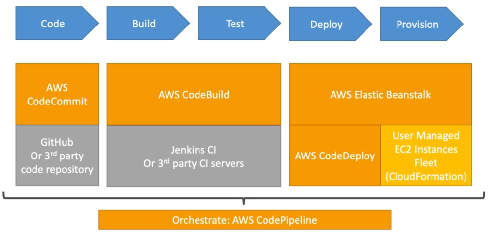
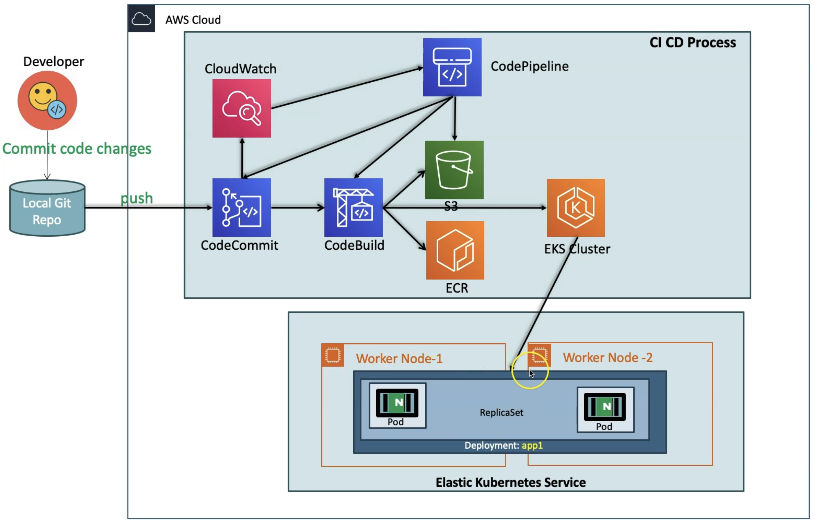

# AWS::CodePipeline::Pipeline

- Orchestrate the whole `Continuous Delivery` flow
  1. `Source` (CodeCommit, Github) monitored via Cloudwatch or Github Webhooks
  1. `Build` (CodeBuild, Jenkins)
  1. `Deploy` (CodeDeploy, Cloudformation, Elastic Beanstalk, S3)




## Properties

- <https://docs.aws.amazon.com/AWSCloudFormation/latest/UserGuide/aws-resource-codepipeline-pipeline.html>

```yaml
Type: AWS::CodePipeline::Pipeline
Properties:
  ArtifactStore:
    ArtifactStore
  ArtifactStores:
    - ArtifactStoreMap
  DisableInboundStageTransitions:
    - StageTransition
  ExecutionMode: String
  Name: String
  PipelineType: String
  RestartExecutionOnUpdate: Boolean
  RoleArn: String
  Stages:
    - StageDeclaration
  Tags:
    - Tag
  Triggers:
    - PipelineTriggerDeclaration
  Variables:
    - VariableDeclaration
```

### RoleArn

- The IAM Role to allow CodePipeline to modify AWS resources

### ArtifactStore

- Specify a custom location for the generated artifacts
- By defaults stores it at a S3 bucket (`codepipeline-us-east-1-99999`)
