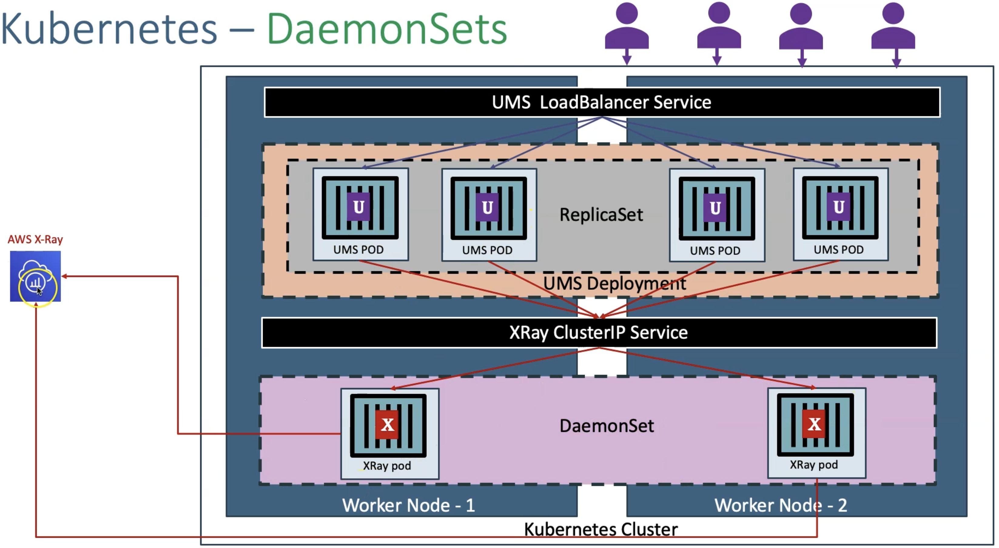

# AWS::XRay::Group

- Distributed tracing!
- X-Ray provides an `end-to-end view of requests` as they travel through your application
- Show a map of your application’s underlying components
- You can use X-Ray to collect data `across AWS Accounts`

- Steps
  1. `Collect traces`: collect data about the request from each of the underlying application services it passes through
  1. `Record traces`: X-Ray combines the data gathered from each service into singular units called traces
  1. `View service map`: view the service map to see trace data such as latencies HTTP statuses, and metadata for each service
  1. `Analyze issues`: drill into the service showing unusual behavior to identify the root issue

## X-Ray SDK

- The application pods should `imperatively send the traces` to the single x-ray pod in each node (they won't be scraped)
- For that your application should embed the X-Ray SDK
- You can instrument each function call in the application code so that it appears as a **segment** in the trace
- You can also enable `plugins` in the X-Ray SDK. For instance the EKS plugin enhances the trace with nodes metadata (e.g., pod id, container id, etc) and the EC2 plugin (e.g., az, ami id, instance size, etc)

- Environment Variables
  - `AWS_XRAY_TRACING_NAME`: the name of the "application" that will be shown in the trace
  - `AWS_XRAY_DAEMON_ADDRESS`: where to send the traces to. E.g., "x-ray-daemonset-svc.default:2000"
  - `AWS_XRAY_CONTEXT_MISSING`: what to do when traces fails to be sent. E.g., "LOG_ERROR", "RUNTIME_ERROR"

## EKS Setup

### DaemonSet

- A `X-Ray` DaemonSet has to be deployed on the Kubernetes cluster in order to collect the traces from all the application pods in each node

- `X-Ray` pods from the DaemonSet then consolidates all the traces and send it to X-ray Service



```yaml
apiVersion: v1
kind: ServiceAccount
metadata:
  name: xray-sa # This SA is automatically created by eksctl create iamserviceaccount
  namespace: default
  annotations:
    eks.amazonaws.com/role-arn: arn:aws:iam::123456789012:role/eksctl-eksdemo1-addon-iamserviceaccount-defa-Role1-VR2R60B6MMDV
---
apiVersion: apps/v1
kind: DaemonSet
metadata:
  name: xray-daemon
  namespace: default
spec:
  updateStrategy:
    type: RollingUpdate
  selector:
    matchLabels:
      app: xray-daemon
  template:
    metadata:
      labels:
        app: xray-daemon
    spec:
      serviceAccountName: xray-sa
      containers:
        - name: xray-daemon
          image: amazon/aws-xray-daemon:3.2.0
          command: ["/usr/bin/xray", "-c", "/aws/xray/config.yaml"]
          resources:
            requests:
              cpu: 256m
              memory: 32Mi
            limits:
              cpu: 512m
              memory: 64Mi
          ports:
            - name: xray-ingest
              containerPort: 2000
              hostPort: 2000
              protocol: UDP
            - name: xray-tcp
              containerPort: 2000
              hostPort: 2000
              protocol: TCP
          volumeMounts:
            - name: config-volume
              mountPath: /aws/xray
              readOnly: true
      volumes:
        - name: config-volume
          configMap:
            name: "xray-config"
---
apiVersion: v1
kind: ConfigMap
metadata:
  name: xray-config
  namespace: default
data:
  config.yaml: |-
    TotalBufferSizeMB: 24
    Socket:
      UDPAddress: "0.0.0.0:2000"
      TCPAddress: "0.0.0.0:2000"
    Version: 2
---
apiVersion: v1
kind: Service
metadata:
  name: xray-svc
  namespace: default
spec:
  selector:
    app: xray-daemon
  clusterIP: None
  ports:
    - name: xray-ingest
      port: 2000
      protocol: UDP
    - name: xray-tcp
      port: 2000
      protocol: TCP
```

### Permissions

- The X-Ray DaemonSet needs outbound permissions to write traces to the AWS X-Ray resource. For that an IRSA or Pod Identity is needed
- The new role needs the policy `AWSXRayDaemonWriteAccess`. This role will be associated with the ServiceAccount that will the X-Ray DaemonSet will use

## Properties

- <https://docs.aws.amazon.com/AWSCloudFormation/latest/UserGuide/aws-resource-xray-group.html>

```yaml
Type: AWS::XRay::Group
Properties:
  FilterExpression: String
  GroupName: String
  InsightsConfiguration:
    InsightsConfiguration
  Tags:
    - Tag
```
