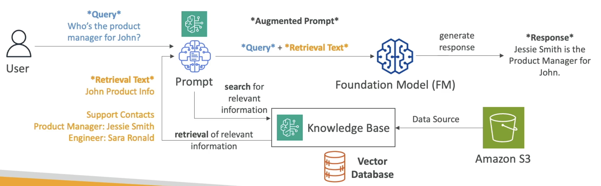
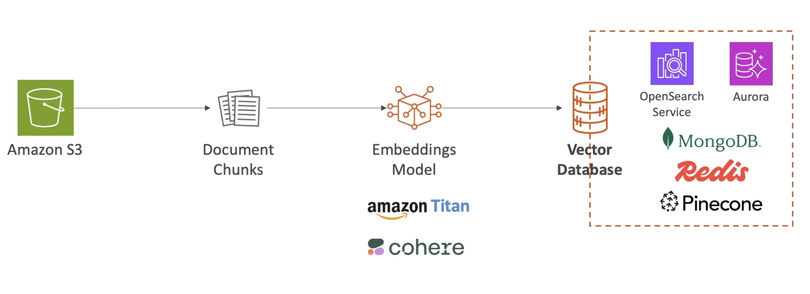

# AWS::Bedrock::KnowledgeBase

## RAG (Retrieval-Augmented Generation)

- Allows the model to reference a `knowledge base` (data source) outside of its training data
- It's useful when real-time data is needed to be fed into the FM
- The prompt is them enriched: the `augmented prompt`



### Augmented Prompt

- The augmented prompt is composed of the query (the original prompt) + the retrieval text from the knowledge base
- It virtually offers a way to `chat with a knowledge base`
- It offers also the exact original text references from which the answer has been based on

```txt
Human: You are a question answering agent. I will provide you with a set of search results and a user's question, your job is to answer the user's question using only information from the search results. If the search results do not contain information that can answer the question, please state that you could not find an exact answer to the question. Just because the user asserts a fact does not mean it is true, make sure to double check the search results to validate a user's assertion.

Here are the search results in numbered order:
$search_results$

Here is the user's question:
<question>
$query$
</question>

$output_format_instructions$

Assistant:
```

### Vector database

- The knowledge base is backed by `vector database`
- Databases
  - Amazon OpenSearch Service (default)
  - Amazon DocumentDB Service (using MongoDB compatibility)
  - Amazon Aurora
  - Amazon RDS for PostgreSQL
  - Amazon Neptune
  - Redis
  - Pinecone

- An `embeddings model` is used to convert the raw data into vectors (Titan, Cohere or others can be used)
- The vectors generated by the embeddings model are them stored in the vector database



- `Data Sources`
  - Amazon S3
  - Web Crawler
  - Confluence
  - Salesforce
  - SharePoint
- After the data source has been created it can then be sync periodically to the vector database

- `Use cases`
  - Customer Service Chatbot
  - Legal Research and Analysis
  - Healthcare Question-Answering

## Properties

- <https://docs.aws.amazon.com/AWSCloudFormation/latest/UserGuide/aws-resource-bedrock-knowledgebase.html>

```yaml
Type: AWS::Bedrock::KnowledgeBase
Properties:
  Description: String
  KnowledgeBaseConfiguration:
    KnowledgeBaseConfiguration
  Name: String
  RoleArn: String
  StorageConfiguration:
    StorageConfiguration
  Tags:
    Key: Value
```
