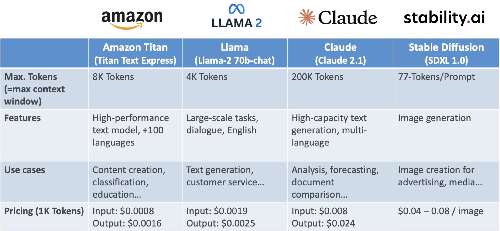
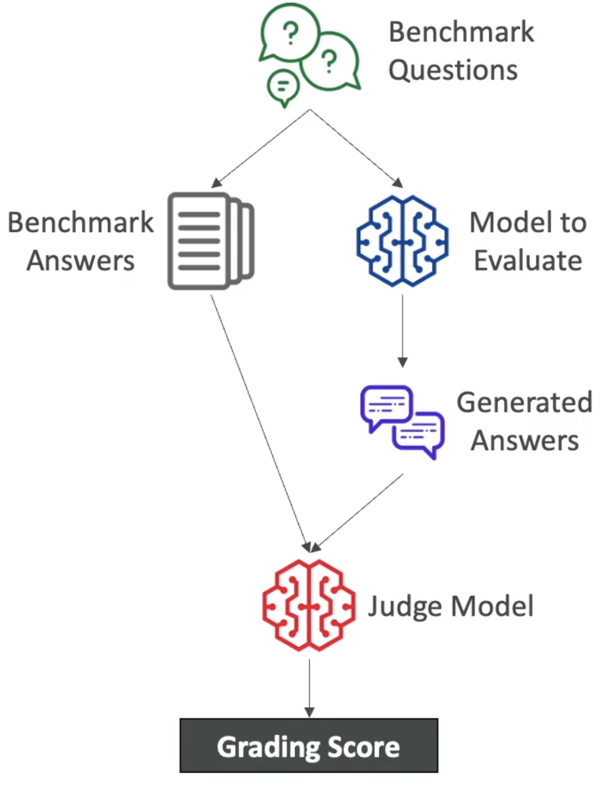
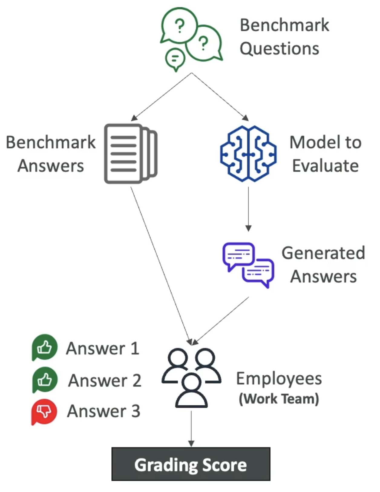
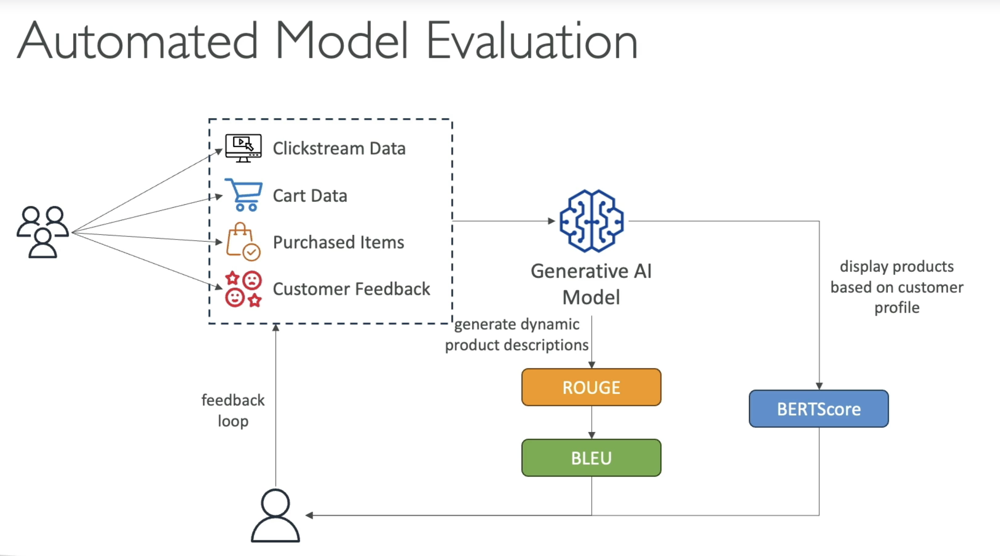

# Amazon Bedrock

- Build Gen-AI applications
- Fully managed service


## Providers & Foundation Models

- **AI21 Labs** (Jurassic-2)
- **Anthropic** (Claude)
- **Stability AI** (Stable Diffusion)
- **Amazon** (Titan)
- **Cohere** (Command)
- **Meta** (Llama)
- **Mistral AI** (Mistral)



- Bedrock makes a copy of the FM which you can further fine-tune with your own data
  - None of your own data is used to train the FM and will never be sent back to the the providers to train the FM

- In order to use the models you must first `request access to the models`. Some providers may require an explanation on the use-case (e.g., Anthropic)

## Playground

- It offers a playground for exploring `chat`, `text` and `image` capabilities
- It is possible to `compare` results from two different models

## Fine tuning & Custom Models

- Create a custom model on top a base model using your own data
- Changes the weights of the base foundation model
- Adapt the model for domain-specific tasks
- The custom must be then evaluated to know if it fits the desired goal

- **Hyperparameters**
  - Epochs
  - Batch size
  - Learning rate
  - Learning rate warmup steps

### Instruction-based fine-tuning

- Instruction-based fine-tuning uses `labeled data` in form of prompt-response pairs
- Usually cheaper (computations less intensive and less data required)

```json
{
  "prompt": "Who is Henry?",
  "completion": "Henry is a person born in ..."
}
```

- Choose new data from S3 (a service role is necessary)
- The data must be in the `dataset` format
- To create the fine-tuning job it is necessary to purchase `provisioned throughput` (expensive)

- **Single-Turn Messaging**
  - Give hints on how a chatbot should be replying

```json
{
  // context for the conversation
  "system": "You are an helpful assistant.",
  "messages": [
    {
      // either "user" or "assistant"
      "role": "user",
      // the text content of the message
      "content": "What is AWS"
    },
    {
      "role": "assistant",
      "content": "It's Amazon Web Services."
    }
  ]
}
```

- **Multi-Turn Messaging**
  - Similar to single-turn, but handles conversations with bigger contexts

### Domain Adaptation Fine-tuning (continued pre-training)

- Provide `unlabeled data` to continue the training of a FM

```json
{
  "input": "Out CTA (Commodity Trading Advisor) strategy incorporates a blend of ..."
}
```

- Also called `domain-adaptation fine-tuning` to make a model expert in a specific domain
- Good to feed industry-specific terminology into a model (acronyms, etc)

### Model Improvement Technique Cost Order

1. \$ Prompt Engineering
    - No model training needed
    - No additional computation or fine-tuning
1. \$\$ Retrieval Augmented Generation (RAG)
    - Uses external knowledge (FM doesn't need to know everything, less complex)
    - No FM changes (no additional computation or fine-tuning)
1. \$\$\$ Instruction-based Fine-tuning
    - FM is fine tuned with specific instructions (requires additional computation)
1. \$\$\$\$ Domain Adaptation Fine-tuning
    - Model is trained on a domain-specific dataset (requires intensive computation)

## Model Evaluation

- Evaluation a model (or a custom model) for quality control based on benchmark questions

- Tasks types
  - `General text generation`
  - `Text summarization`
  - `Question and answer`
  - `Text classification`

- **Grading Scores** are calculated by a `judge model` by comparing the benchmark answer and the generated answer



- Or the scores can be evaluated by a human, an `Subject-Matter Expert` (SME)
  - Thumbs up/down, ranking, etc



### Metrics to evaluate a model

- Scores are calculated using various statistical methods

- **ROUGE** (Recall-Oriented Understudy for Gisting Evaluation)
  - Evaluat automatic summarization and machine translation systems
  - `ROUGE-N`: measure the number of n-grams between reference and generated texts
  - `ROUGE-L`: longest common subsequence between reference and generated text

- **BLEU** (Bilingual Evaluation Understudy)
  - Evaluate the quality of generated text, specially for translations
  - Considers both precision and penalizes too much brevity
  - Looks at a combination of n-grams

- **BERTScore** (Bidirectional Encoder Representations from Transformers - Score)
  - Semantic similarity between generated text (compares the actual meanings between two texts)
  - Uses pre-trained BERT models to compare the contextualized embeddings of both texts and computes the cosine similarity between them

- **Perplexity**
  - How well the model predicts the next token
  - Lower is better



- **Business Metrics**
  - User Satisfaction
  - Average REvenue Per User (ARPU)
  - Cross-Domain Performance
  - Conversion Rate
  - Efficiency

## Bedrock Studio

- Dashboard interface to create AI-powered application

## Pricing

- `On-demand`
  - Pas-as-you-go
  - Text models: charged for every input/output token processed
  - Embeddings models: charged for every input token processed
  - Image models: charged for every image generated

- `Provisioned Throughput`
  - Pay for a certain time (1 month, 6 months, etc)
  - Booked Throughput: max. number of input/output tokens processed per minute
  - Works with base, fine-tuned, and custom models

## Observability

- **Model invocation logging**
  - Send logs of all `model invocations` to CloudWatch and/or S3
  - Data types to include with logs: text, images, embeddings
  - Can be later analyzed using CloudWatch Logs Insights
  - It is enabled under Bedrock settings

- **Metrics**
  - Publish metrics to CloudWatch
  - `ContentFilteredCount`: understand how the guardrails are being used
  - `InvocationLatency`: average time to give an answer
