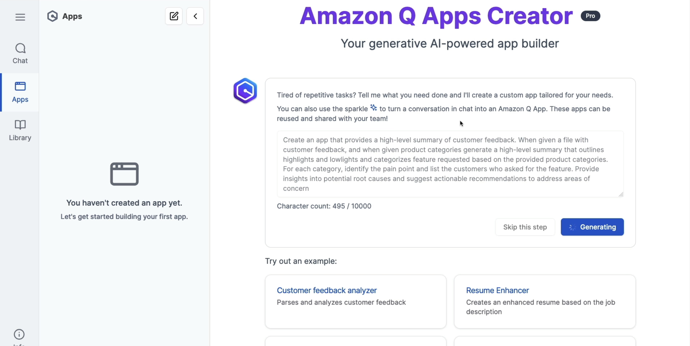

# AWS::QBusiness::Application

- Generative AI-powered app builder
- Create AI apps without coding by using natural language
- Leverages the company's internal data
- The interface for creating apps is accessed from the same WebExperience portal
- The apps can then be `published` and be accessed by your `libraries`

## Properties

- <https://docs.aws.amazon.com/AWSCloudFormation/latest/UserGuide/aws-resource-qbusiness-application.html>

