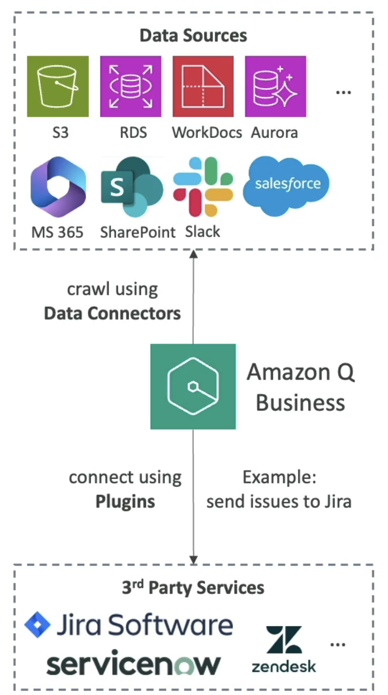

# AWS::QBusiness::DataSource

- A `connector` integrates a company source of knowledge into the FM
- **Data connectors** are fully managed RAG
- Also offers **plugins** which allows you to interact with 3rd party services not natively supported



## Properties

- <https://docs.aws.amazon.com/AWSCloudFormation/latest/UserGuide/aws-resource-qbusiness-datasource.html>

```yaml
Type: AWS::QBusiness::DataSource
Properties:
  ApplicationId: String
  Configuration:

  Description: String
  DisplayName: String
  DocumentEnrichmentConfiguration:
    DocumentEnrichmentConfiguration
  IndexId: String
  RoleArn: String
  SyncSchedule: String
  Tags:
    - Tag
  VpcConfiguration:
    DataSourceVpcConfiguration
```
