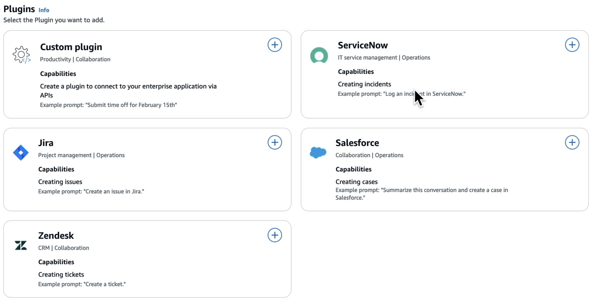

# AWS::QBusiness::Plugin

- Connect to data sources not natively supported



## Properties

- <https://docs.aws.amazon.com/AWSCloudFormation/latest/UserGuide/aws-resource-qbusiness-plugin.html>

```yaml
Type: AWS::QBusiness::Plugin
Properties:
  ApplicationId: String
  AuthConfiguration:
    PluginAuthConfiguration
  CustomPluginConfiguration:
    CustomPluginConfiguration
  DisplayName: String
  ServerUrl: String
  State: String
  Tags:
    - Tag
  Type: String
```
