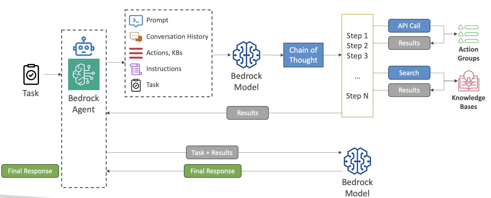
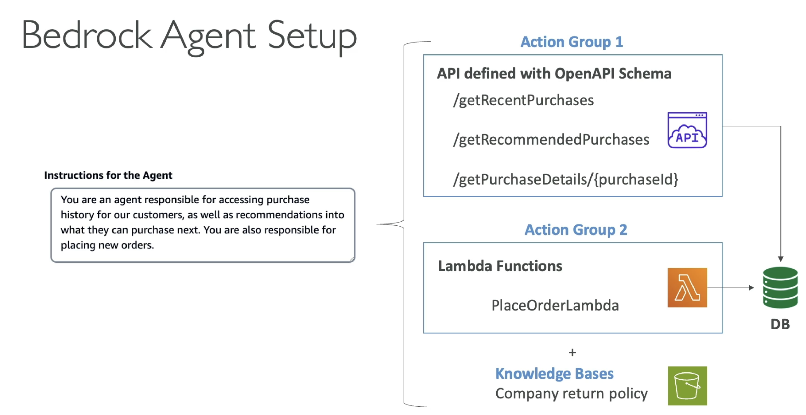

# AWS::Bedrock::Agent

- Agents may carry out `tasks related to infrastructure provisioning` on AWS, deployments, etc
- Leverage RAG to retrieve real-time information when necessary



```yaml
Type: AWS::Bedrock::Agent
Properties:
  ActionGroups:
    - AgentActionGroup
  AgentName: String
  AgentResourceRoleArn: String
  AutoPrepare: Boolean
  CustomerEncryptionKeyArn: String
  Description: String
  FoundationModel: String
  GuardrailConfiguration:
    GuardrailConfiguration
  IdleSessionTTLInSeconds: Number
  Instruction: String
  KnowledgeBases:
    - AgentKnowledgeBase
  PromptOverrideConfiguration:
    PromptOverrideConfiguration
  SkipResourceInUseCheckOnDelete: Boolean
  Tags:
    Key: Value
  TestAliasTags:
    Key: Value
```

## ActionGroups

- Agents are configured to perform specific pre-defined `action groups`
- The action groups restricts have the agent knows to do and therefore limits its actions


