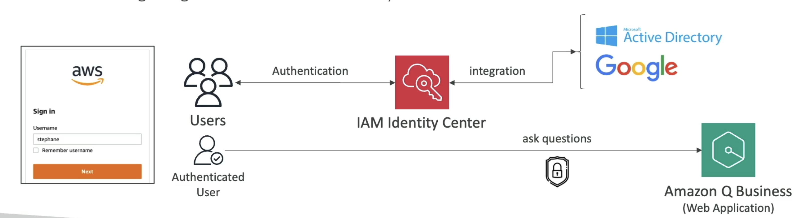

# Amazon Q

- AI assistant for your employees
- Based on the company's knowledge
- Built on top on Bedrock (but you can't choose the underlying FM)

```txt
Write a job posting for a Senior Product Marketing Manager role

Create a social media post under 50 words to advertise the new role

What was discussed during the team meetings in the week of 4/12?
```

## Authentication

- Users authenticate via IAM



## Admin Controls

- Controls and customize responses to your organization needs
- Same as Bedrock's guardrails
- It's possible to allow Amazon Q to fall back to LLM general knowledge when the information is not found in the company data sources

## Q for QuickSight

- `Amazon QuickSight` is used to create dashboards visualize data
- New dashboards can be created using Amazon Q and QuickSight

## Q for EC2

- Helps on choosing which type of EC2 instance you need
based on your workload

## Q for AWS Chatbot

- `AWS Chatbot` is a way to deploy a chatbot in Slack, Teams, etc
- Amazon Q can be accessed directly through Chatbot
- Use cases with Amazon Q
  - Troubleshoot issues
  - Receive notifications for alarms
  - Security findings
  - Billing alerts
  - Create support request
