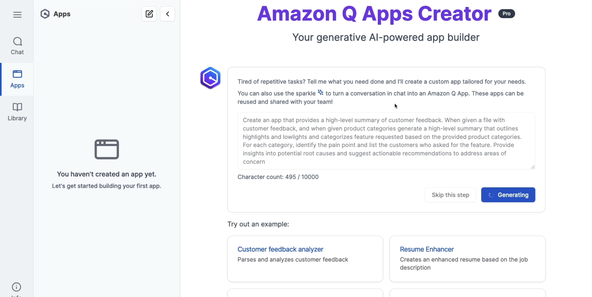

# AWS::QBusiness::Application

- Generative AI-powered app builder
- Create AI apps without coding by using natural language
- Leverages the company's internal data
- The interface for creating apps is accessed from the same WebExperience portal
- The apps can then be `published` and be accessed by your `libraries`



```yaml
Type: AWS::QBusiness::Application
Properties:
  AttachmentsConfiguration:
    AttachmentsConfiguration
  AutoSubscriptionConfiguration:
    AutoSubscriptionConfiguration
  ClientIdsForOIDC:
    - String
  Description: String
  DisplayName: String
  EncryptionConfiguration:
    EncryptionConfiguration
  IamIdentityProviderArn: String
  IdentityCenterInstanceArn: String
  IdentityType: String
  PersonalizationConfiguration:
    PersonalizationConfiguration
  QAppsConfiguration:
    QAppsConfiguration
  RoleArn: String
  Tags:
    - Tag
```
