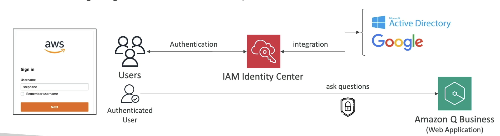

# Amazon Q

- AI assistant for your employees
- Based on the company's knowledge
- Built on top on Bedrock (but you can't choose the underlying FM)

```txt
Write a job posting for a Senior Product Marketing Manager role

Create a social media post under 50 words to advertise the new role

What was discussed during the team meetings in the week of 4/12?
```

## Authentication

- Users authenticate via IAM



## Admin Controls

- Controls and customize responses to your organization needs
- Same as Bedrock's guardrails
- It's possible to allow Amazon Q to fall back to LLM general knowledge when the information is not found in the company data sources
