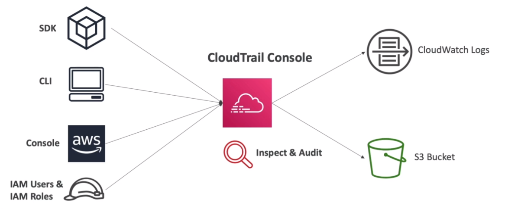
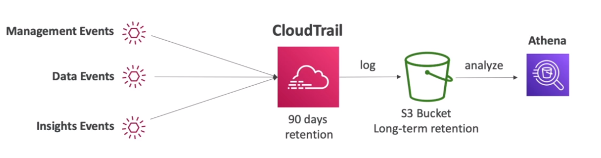
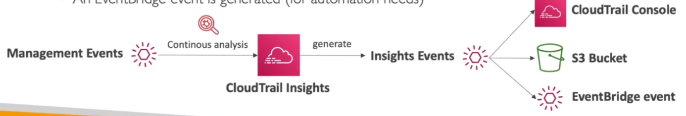

# AWS::CloudTrail::Trail

- Focused on `auditing`, `governance` and `compliance` of AWS account activity
- Provides a history of `who did what, when, and from where` within your AWS environment.
- History of all events and API calls in the account (console, sdk, cli)



## Events Retention

- Events are stored for `90 days`
- To keep events beyond this period, log them to S3 using `trails`



## Properties

- <https://docs.aws.amazon.com/AWSCloudFormation/latest/UserGuide/aws-resource-cloudtrail-trail.html>

```yaml
Type: AWS::CloudTrail::Trail
Properties:
  AdvancedEventSelectors:
    - AdvancedEventSelector
  CloudWatchLogsLogGroupArn: String
  CloudWatchLogsRoleArn: String
  EnableLogFileValidation: Boolean
  EventSelectors:
    - EventSelector
  IncludeGlobalServiceEvents: Boolean
  InsightSelectors:
    - InsightSelector
  IsLogging: Boolean
  IsMultiRegionTrail: Boolean
  IsOrganizationTrail: Boolean
  KMSKeyId: String
  S3BucketName: String
  S3KeyPrefix: String
  SnsTopicName: String
  Tags:
    - Tag
  TrailName: String
```

### EventSelectors

- `Management Events`: operations on aws resources (e.g., configure iam, configure vpc) - Read or Write events
- `Data Events`: data from aws resources (e.g., s3 object activity, lambda executions)
- `Cloudtrail Insights Events`: detect unusual write activities in the account (e.g., hittings service limits, bursts iam actions)

### InsightSelectors

- `Cloudtrail Insights` detects unusual activities



### S3BucketName

- `Trail` is a policy to save events to an `s3 bucket` and `cloudwatch`
- You choose the events to store (management, data(lambda, s3, etc), insights)
- `Filter` events by attributes (e.g., only write events)
