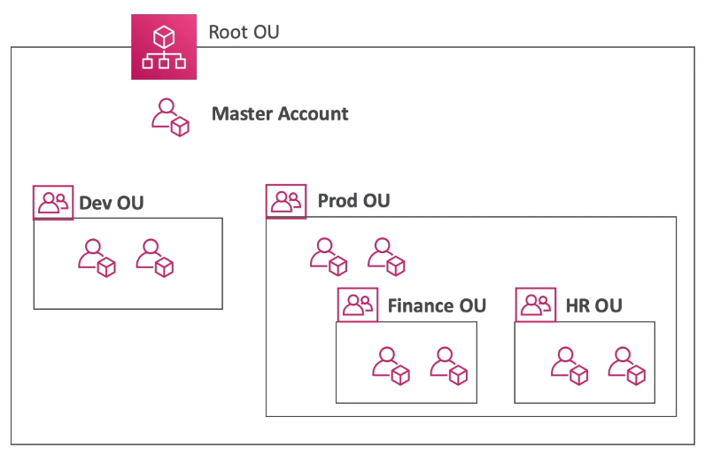

# AWS::Organizations::OrganizationalUnit

- An `Organizational Unit` (OU) is a container for accounts that enables you to organize your accounts to apply policies according to your business requirements
- It's best practice to keep the `master account` under the `root OU`



## Properties

```yaml
Type: AWS::Organizations::OrganizationalUnit
Properties:
  Name: String
  ParentId: String
  Tags:
    - Tag
```
