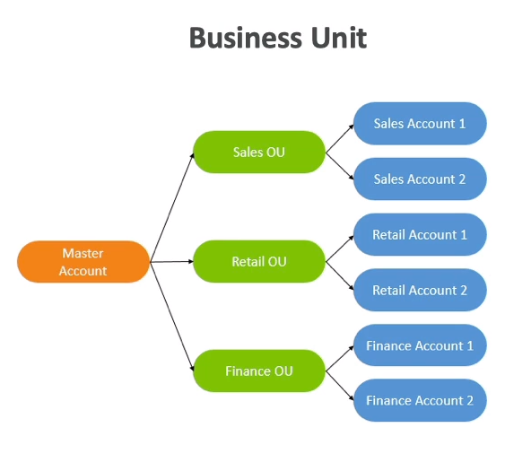
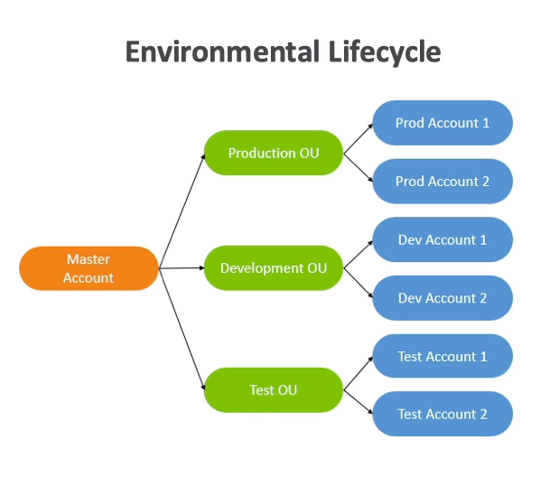
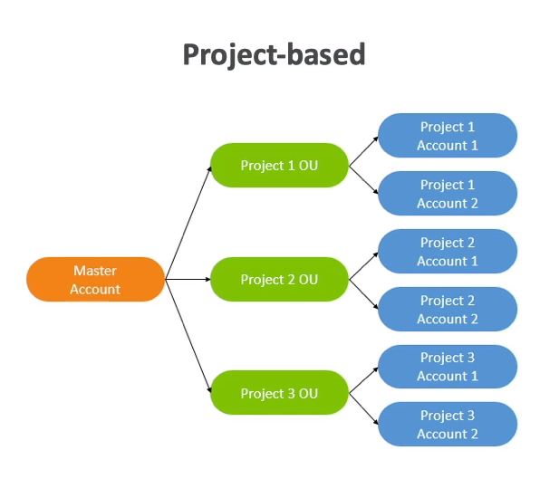

# Multi Account Strategies

- Create accounts per `department`, `dev/test/prod`, `per VPC`, ...
- Per account `service limits`
- Isolated account for `logging`

## Per Business Unit

## Per Environmental Lifecycle

## Per Project

