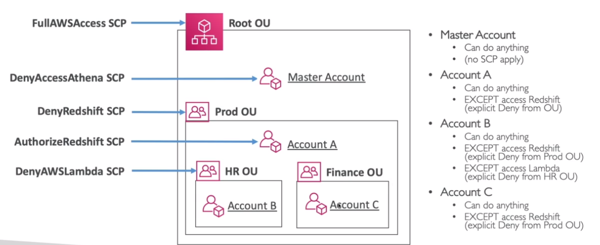

# Service Control Policies (SCP)

- `Whitelists` or `Blacklists` IAM actions
- The `SCP` is applied to an `OU` or directly to an `account`
- OUs at the `master account` take no effect

## Use cases

- Restrict access to certain services (E.g., can't use EMR)
- Enforce PCI compliance by explicitly disabling services

## SCP Hierarchy



- Affect all users and roles, including root user
- SCP do not affect service-linked role

```json
{
  "Version": "2012-10-17",
  "Statement": [
    {
      "Sid": "AllowsAllActions",
      "Effect": "Allow",
      "Action": "*",
      "Resource": "*"
    },
    {
      "Sid": "DenyDynamoDB",
      "Effect": "Deny",
      "Action": "dynamodb:*",
      "Resource": "*"
    }
  ]
}
```
