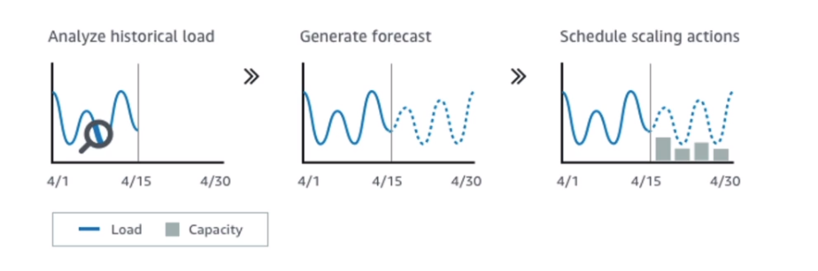

# AWS::AutoScaling::LaunchConfiguration

- It's not possible to modify a launch configuration after its creation

- `Network`
  - VPC
  - Subnets
- `Load Balancer`
  - Attach to existing lb or create new
- `Health Check`
  - On the EC2 directly or on ELB
- `Group Size`
  - Desired capacity
  - Min capacity
  - Max capacity
- `Scaling Policies`
  
- `Scaling Cooldown`
  - Activate whenever a scaling action is triggered
  - Durinding this period scaling actions won't take effect
  - Default to 300s

## Properties

- <https://docs.aws.amazon.com/AWSCloudFormation/latest/UserGuide/aws-resource-autoscaling-launchconfiguration.html>

### ImageId

- The VM image with the OS to run on the EC2 instance
- For EKS cluster it uses a Kubernetes-optimized AMI
