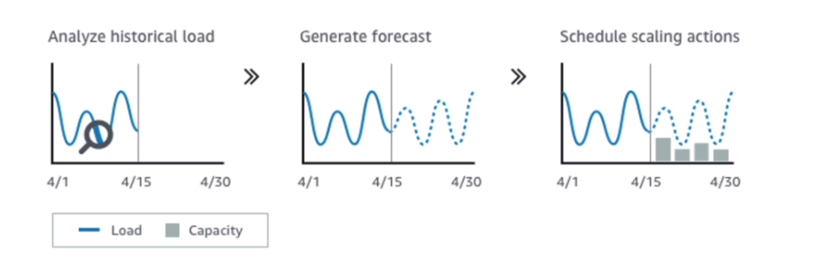

# AWS::AutoScaling::LaunchConfiguration

- It's not possible to modify a launch configuration after its creation

- `Network`
  - VPC
  - Subnets
- `Load Balancer`
  - Attach to existing lb or create new
- `Health Check`
  - On the EC2 directly or on ELB
- `Group Size`
  - Desired capacity
  - Min capacity
  - Max capacity
- `Scaling Policies`
  
- `Scaling Cooldown`
  - Activate whenever a scaling action is triggered
  - Durinding this period scaling actions won't take effect
  - Default to 300s

## Properties

- <https://docs.aws.amazon.com/AWSCloudFormation/latest/UserGuide/aws-resource-autoscaling-launchconfiguration.html>

```yaml
Type: AWS::AutoScaling::LaunchConfiguration
Properties:
  AssociatePublicIpAddress: Boolean
  BlockDeviceMappings:
    - BlockDeviceMapping
  ClassicLinkVPCId: String
  ClassicLinkVPCSecurityGroups:
    - String
  EbsOptimized: Boolean
  IamInstanceProfile: String
  ImageId: String
  InstanceId: String
  InstanceMonitoring: Boolean
  InstanceType: String
  KernelId: String
  KeyName: String
  LaunchConfigurationName: String
  MetadataOptions:
    MetadataOptions
  PlacementTenancy: String
  RamDiskId: String
  SecurityGroups:
    - String
  SpotPrice: String
  UserData: String
```
