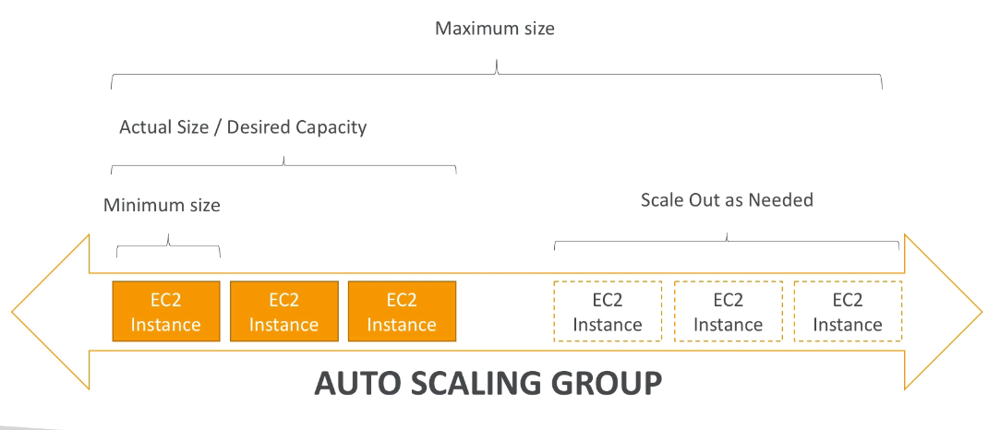

# AWS::AutoScaling::AutoScalingGroup

- `Auto Scaling Groups` (ASG) scales instances to match the load demand
  - `Scale out`: add instances
  - `Scale in`: remove instances



- New instances can be `automatically registered` to LB
- ASG ensures to keep the desired number of replicas
- ASG terminates unhealthy instances can relaunch it

```yaml
Type: AWS::AutoScaling::AutoScalingGroup
Properties:
  AutoScalingGroupName: String
  AvailabilityZones:
    - String
  CapacityRebalance: Boolean
  Context: String
  Cooldown: String
  DesiredCapacity: String
  HealthCheckGracePeriod: Integer
  HealthCheckType: String
  InstanceId: String
  LaunchConfigurationName: String
  LaunchTemplate: LaunchTemplateSpecification
  LifecycleHookSpecificationList:
    - LifecycleHookSpecification
  LoadBalancerNames:
    - String
  MaxInstanceLifetime: Integer
  MaxSize: String
  MetricsCollection:
    - MetricsCollection
  MinSize: String
  MixedInstancesPolicy: MixedInstancesPolicy
  NewInstancesProtectedFromScaleIn: Boolean
  NotificationConfigurations:
    - NotificationConfiguration
  PlacementGroup: String
  ServiceLinkedRoleARN: String
  Tags:
    - TagProperty
  TargetGroupARNs:
    - String
  TerminationPolicies:
    - String
  VPCZoneIdentifier:
    - String
```

- Reasons to not terminate an unhealthy instance:
  - Instance on `impaired status`
  - Healthcheck `grace period` has not yet expired
  - Instance has failed ELB health check

## LaunchTemplate

- Reference to `AWS::EC2::LaunchTemplate`
- `LaunchTemplate` can be used to provision capacity `across multiple instance types` (e.g., on-demand and spot instances)

## LaunchConfigurationName

- Reference to `AWS::AutoScaling::LaunchConfiguration`
- `LaunchConfiguration` cannot be used to provision capacity to multiple instance types

## TerminationPolicies

- `Termination Policy`
  - Terminate instance from AZ with most instances
  - Terminate instance with oldest launch configuration
