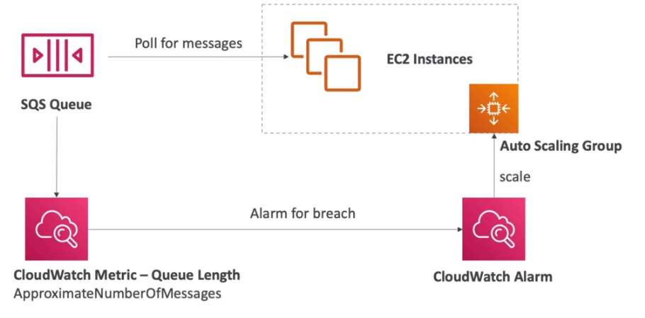

# AWS::AutoScaling::ScalingPolicy

```yaml
Type: AWS::AutoScaling::ScalingPolicy
Properties:
  AdjustmentType: String
  AutoScalingGroupName: String
  Cooldown: String
  EstimatedInstanceWarmup: Integer
  MetricAggregationType: String
  MinAdjustmentMagnitude: Integer
  PolicyType: String
  PredictiveScalingConfiguration: PredictiveScalingConfiguration
  ScalingAdjustment: Integer
  StepAdjustments:
    - StepAdjustment
  TargetTrackingConfiguration: TargetTrackingConfiguration
```

- **Scale based on SQS queue length**
  - Scale horizontally the consumers
  - Scaling the ASG can be based on the custom metric `Queue Length` (from CloudWatch)
    

## PolicyType

- **TargetTrackingScaling**
  - Based on a metric
  - SQS queue
  - E.g., CPUUtilization, RequestCountPerTarget, Average Network In / Out
- **StepScaling**
  - Based on alarm from `CloudWatch`
- **Simple Scaling** (default)
  - Based on alarm from `CloudWatch`
- **PredictiveScaling**
  - Continuously forecast load and schedule scaling ahead

If multiple policies are reached at the same time, the one that scales more instances is triggered
