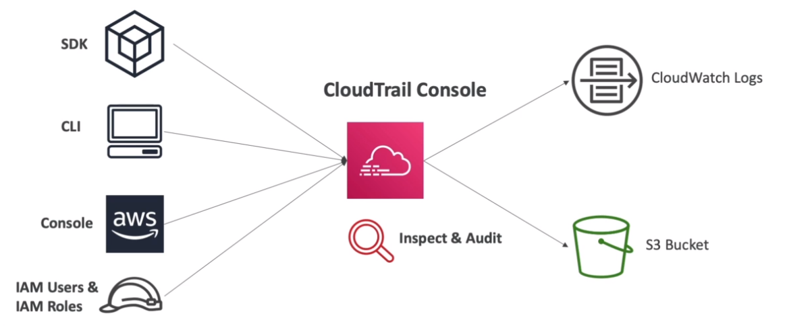

# AWS::CloudTrail::Trail

- Provides `governance`, `compliance` and `audit` for your AWS account
- History of all events and API calls in the account (console, sdk, cli)
- These logs can be sent to cloudwatch or s3



```yaml
Type: AWS::CloudTrail::Trail
Properties:
  CloudWatchLogsLogGroupArn: String
  CloudWatchLogsRoleArn: String
  EnableLogFileValidation: Boolean
  EventSelectors:
    - EventSelector
  IncludeGlobalServiceEvents: Boolean
  InsightSelectors:
    - InsightSelector
  IsLogging: Boolean
  IsMultiRegionTrail: Boolean
  IsOrganizationTrail: Boolean
  KMSKeyId: String
  S3BucketName: String
  S3KeyPrefix: String
  SnsTopicName: String
  Tags:
    - Tag
  TrailName: String
```

- **Events Retention**
  - Events are stored for `90 days`
  - To keep events beyond this period, log them to S3 using `trails`
    

## EventSelectors

- `Management Events`: operations on aws resources (e.g., configure iam, configure vpc) - Read or Write events
- `Data Events`: data from aws resources (e.g., s3 object activity, lambda executions)
- `Cloudtrail Insights Events`: detect unusual write activities in the account (e.g., hittings service limits, bursts iam actions)

## InsightSelectors

- `Cloudtrail Insights` detects unusual activities


## S3BucketName

- `Trail` is a policy to save events to an `s3 bucket` and `cloudwatch`
- You choose the events to store (management, data(lambda, s3, etc), insights)
- `Filter` events by attributes (e.g., only write events)
