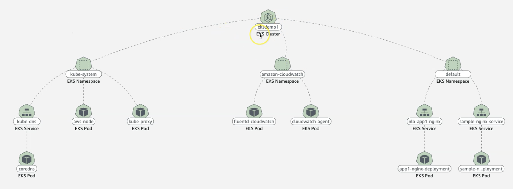
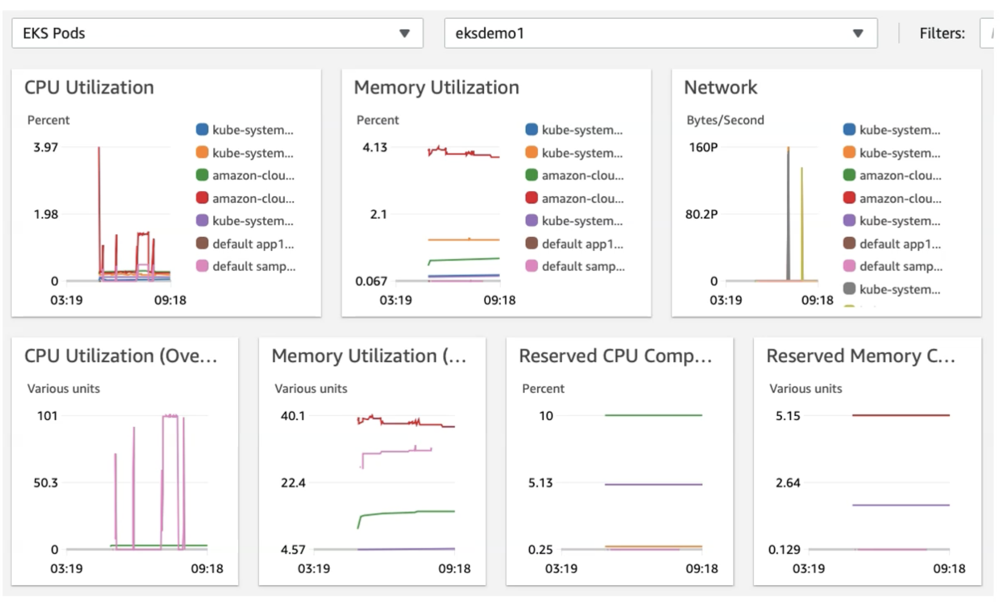

# AWS::CloudWatch::InsightRule

- Provide `metrics` for every service in AWS
- Cloudwatch is commonly used as base for `auto scaling`
- `Source`: Elastic Beanstalk, EC2, VPC, SDK, ...
- `Sink`: S3, ElasticSearch, ...

## Container Insights

- Collect & aggregate `metrics` and `logs`
- Metrics include `resources utilization`
- Provides `diagnostic information` such as container restart failures, etc
- Can be coupled with `CloudWatch Alarms`

### Kubernetes CloudWatch Agent

- It's a `DaemonSet` that runs on the EKS cluster and collects metrics from the Pods and send it to CloudWatch
- The agent needs to be installed on the cluster otherwise it won't appear in Container Insights
- It requires the permission `CloudWatchAgentServerPolicy` attached to the worker nodes
- To facilitate this process you can simply install the EKS Addon `amazon-cloudwatch-observability`
- If you use Fargate profiles, install the EKS Addon `AWS Distro for OpenTelemetry`

### Container Insights Map



### Performance Dashboards



## Properties

- <https://docs.aws.amazon.com/AWSCloudFormation/latest/UserGuide/aws-resource-cloudwatch-insightrule.html>

```yaml
Type: AWS::CloudWatch::InsightRule
Properties:
  RuleBody: String
  RuleName: String
  RuleState: String
  Tags:
    - Tag
```

### RuleBody

- Define and send your own custom metrics to CloudWatch
- Use API `PutMetricData` to send values
- `MetricResolution`: _Standard_ (1min), _High Resolution_ (10 or 30 seconds)

```shell
aws cloudwatch put-metric-data \
  --namespace "Usage Metrics" \
  --metric-data "file://metric.json"
```
