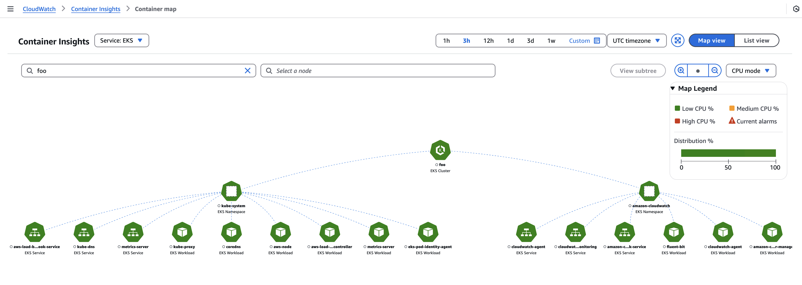
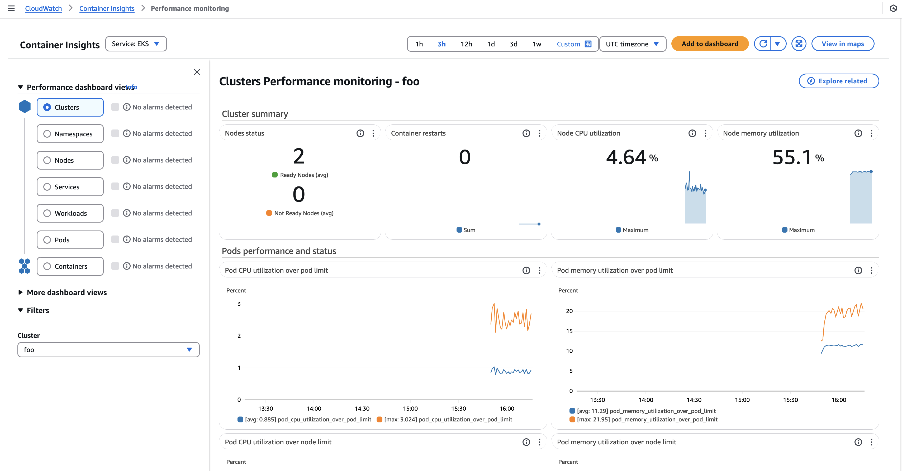

# Container Insights

- Collect & aggregate `metrics` and `logs`
- Metrics include `resources utilization`
- Provides `diagnostic information` such as container restart failures, etc
- Can be coupled with `CloudWatch Alarms`

## Kubernetes CloudWatch Agent

- It's a `DaemonSet` that runs on the EKS cluster and collects metrics from the Pods and send it to CloudWatch
- The agent needs to be installed on the cluster otherwise it won't appear in Container Insights
- It requires the permission `CloudWatchAgentServerPolicy` attached to the worker nodes

```shell
eksctl create iamserviceaccount \
  --name cloudwatch-agent \
  --cluster my-cluster \
  --namespace amazon-cloudwatch \
  --attach-policy-arn arn:aws:iam::aws:policy/CloudWatchAgentServerPolicy \
  --role-only \
  --approve
```

- After creating the required IRSA, you can then install the EKS Addon `amazon-cloudwatch-observability`. It installs:
  - `cloudwatch-agent` (push metrics)
  - `fluent-bit` (push logs)
  - `neuron-monitor`
  - `cloudwatch-controller`

```shell
aws eks create-addon \
  --addon-name amazon-cloudwatch-observability \
  --cluster-name my-cluster-name \
  --service-account-role-arn arn:aws:iam::123456789012:role/<role>
```

- If you use Fargate profiles, install the EKS Addon `AWS Distro for OpenTelemetry`

## Container Map



## Performance Monitoring


