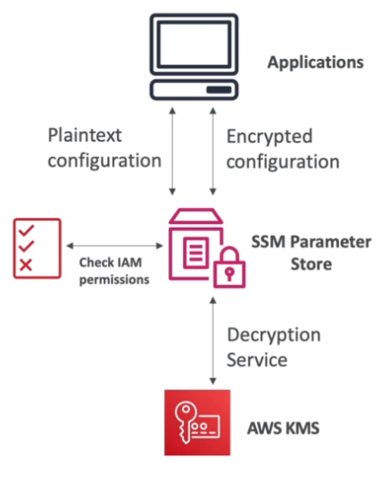

# AWS::SSM::Parameter

- `Systems Manager` (SSM)
- Storage for `configurations` and `secrets`
- `Versioning` of config/secrets
- Optional encryption with KMS



- **Parameter Store Hierarchy**
  - /mydepartment/
    - firstapp/
      - dev/
        - db-url
        - db-password
      - prod/
        - db-url
        - db-password
    - secondapp/
      - ...

```yaml
Type: AWS::SSM::Parameter
Properties:
  AllowedPattern: String
  DataType: String
  Description: String
  Name: String
  Policies: String
  Tags: Json
  Tier: String
  Type: String
  Value: String
```

## Policies

- Allow `TTL`s to force updating or deleting sensitive data

```json
// delete key after some time
{
  "Type": "Expiration",
  "Version": "1.0",
  "Attributes": {
    "Timestamp": "2020-12-02T21:34:33.000Z"
  }
}
```

## Tier

- `Standard`: up to 10k parameters, no policies
- `Advanced`: up to 100k parameters

## Type

- `String`
- `StringList`
- `SecureString`
