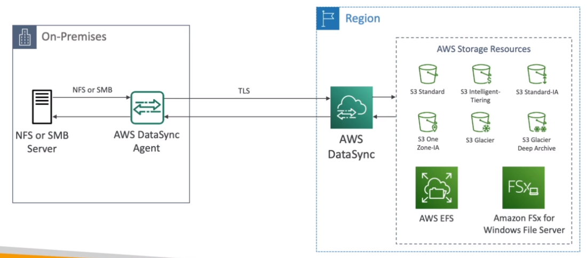
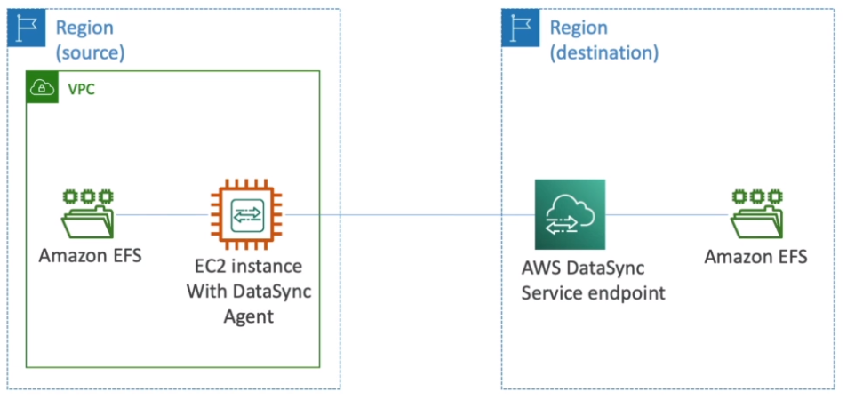

# AWS::DataSync::Task

- Move large amount of data from `on-premise` to `AWS`
- `Synchronize` to:
  - S3 (including Glacier)
  - EFS
  - ESx for Windows
- Uses `NFS` or `SMB` protocol
- `Replication` can be scheduled hourly, daily, weekly
- A DataSync `agent` must be installed in on-premise machines
- Can setup `bandwidth limit`



- Can also be used for `cross-region` `EFS`



## Properties

- <https://docs.aws.amazon.com/AWSCloudFormation/latest/UserGuide/aws-resource-datasync-task.html>

```yaml
Type: AWS::DataSync::Task
Properties:
  CloudWatchLogGroupArn: String
  DestinationLocationArn: String
  Excludes:
    - FilterRule
  Includes:
    - FilterRule
  ManifestConfig:
    ManifestConfig
  Name: String
  Options:
    Options
  Schedule:
    TaskSchedule
  SourceLocationArn: String
  Tags:
    - Tag
  TaskReportConfig:
    TaskReportConfig
```
