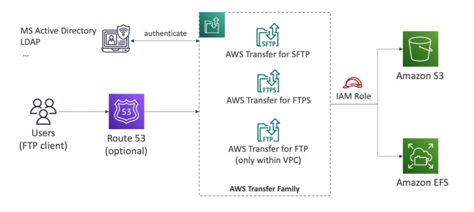

# AWS::Transfer::Server

- `AWS Transfer Family`
- File transfer from/to `S3` or `EFS` using FTP-family protocol
- Pay per `provisioned endpoint`/ hour + data transfer in GB

## Properties

- <https://docs.aws.amazon.com/AWSCloudFormation/latest/UserGuide/aws-resource-transfer-server.html>

### IdentityProviderType

- Integrate with authentication systems: `AD`, `LDAP`, `Okta`, `Amazon Cognito`, etc

### Protocols

- `FTP` (File Transfer Protocol)
- `FTPS` (File Transfer Protocol over SSL)
- `SFTP` (Secure File Transfer Protocol)
