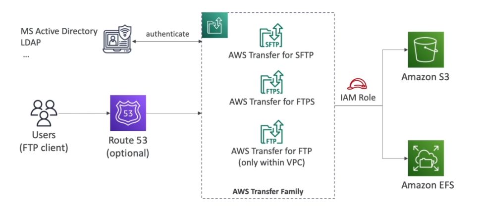

# AWS::Transfer::Server

- `AWS Transfer Family`
- File transfer from/to `S3` or `EFS` using FTP-family protocol
- Pay per `provisioned endpoint`/ hour + data transfer in GB



```yaml
Type: AWS::Transfer::Server
Properties:
  Certificate: String
  Domain: String
  EndpointDetails: EndpointDetails
  EndpointType: String
  IdentityProviderDetails: IdentityProviderDetails
  IdentityProviderType: String
  LoggingRole: String
  ProtocolDetails: ProtocolDetails
  Protocols:
    - Protocol
  SecurityPolicyName: String
  Tags:
    - Tag
  WorkflowDetails: WorkflowDetails
```

## IdentityProviderType

- Integrate with authentication systems: `AD`, `LDAP`, `Okta`, `Amazon Cognito`, etc

## Protocols

- `FTP` (File Transfer Protocol)
- `FTPS` (File Transfer Protocol over SSL)
- `SFTP` (Secure File Transfer Protocol)
