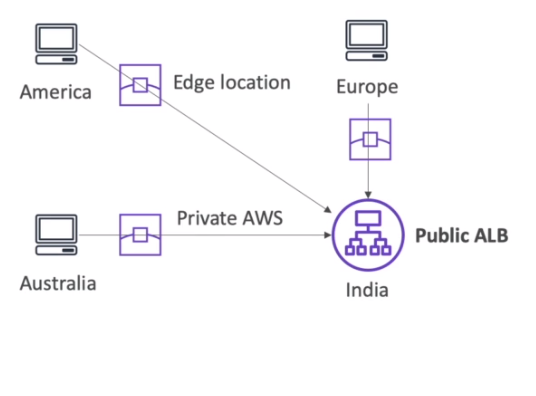

# AWS::GlobalAccelerator::Accelerator

- It `reduces hops` from client until the final destination
- The client now connects to an `edge location` and from there it goes through `AWS internal network` to the application

- **Unicast IP**: one server holds one IP
- **Anycast IP**: all servers hold same IP. Client is forwarded to the closest

- Global Accelerator uses `2 anycast IPs` for the application



- Global Accelerator is a good fit for non-HTTP use cases, such as `gaming (UDP)`, `IoT (MQTT)`, or `Voice over IP`.

## Properties

- <https://docs.aws.amazon.com/AWSCloudFormation/latest/UserGuide/aws-resource-globalaccelerator-accelerator.html>

```yaml
Type: AWS::GlobalAccelerator::Accelerator
Properties:
  Enabled: Boolean
  IpAddresses:
    - String
  IpAddressType: String
  Name: String
  Tags:
    - Tag
```
