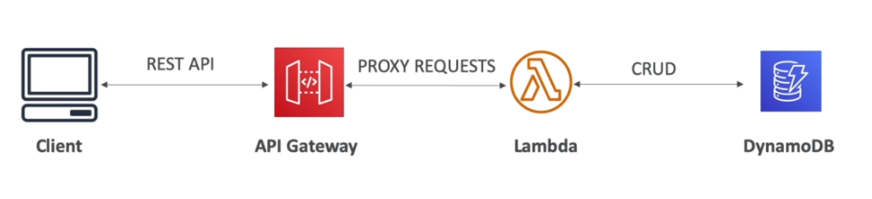

# AWS::ApiGatewayV2::Api

- Serverless API Gateway

- Handle versioning
- Handle different environment (dev, test, prod, ...)
- Handle security (authentication & authorization)
- Request throttling
- Transform and validate requests and responses
- Cache API responses

## Endpoint Types

- **Edge-Optimized** (default)
  - For global clients
  - Requests are routed through `CloudFront Edges`
  - But the API Gateway service itself is still bound to a region
- **Regional**
  - Clients within same region
  - Can manually combine with cloudfront
- **Private**
  - Accessed from within VPC

## Request Flow

- Client -> Method Request -> Integration Request -> Service
- Service -> Integration Response -> Method Response -> Client

## Properties

- <https://docs.aws.amazon.com/AWSCloudFormation/latest/UserGuide/aws-resource-apigatewayv2-api.html>

### ProtocolType

- `HTTP API`: e.g., apps with cors, oauth, oidc
- `WebSocket API`: e.g., chats, dashboards
- `REST API`
