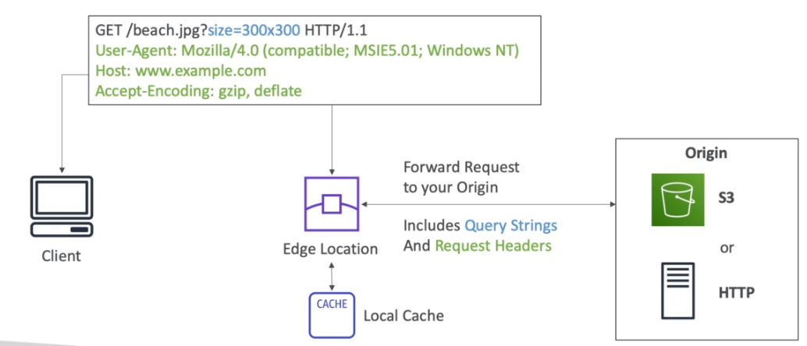
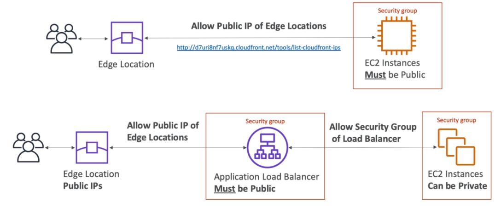
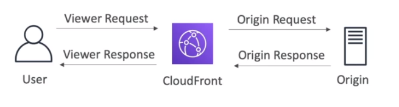
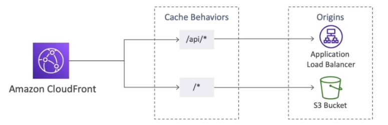
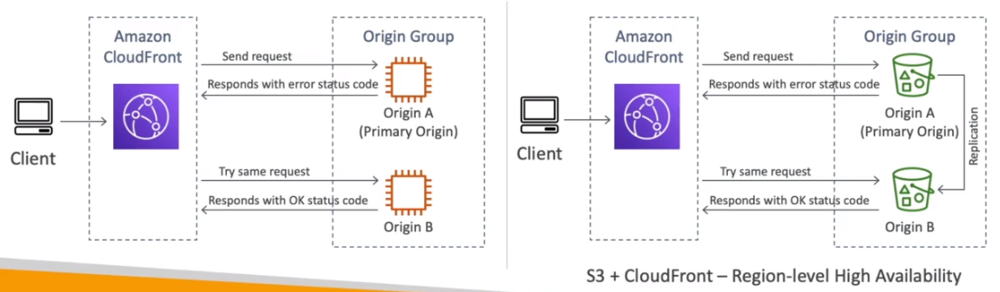

# AWS::CloudFront::Distribution

- It's a `Content Delivery Network` (CDN)
- Cache responses at the edges (216 `Points of Presence` (PoP) around the world)
- Use case: `static content` with a TTL. Bad for dynamic content!



- Integration with `Shield` (`DDoS` protection)
- AWS Web Application `Firewall`



- Regional edge cache `bypass`
  - Proxy methods `PUT`/`POST`/`PATCH`/`OPTIONS`/`DELETE`
  - Dynamic content (cache-behavior configured to forward all headers)

## Properties

- <https://docs.aws.amazon.com/AWSCloudFormation/latest/UserGuide/aws-resource-cloudfront-distribution.html>

```yaml
Type: AWS::CloudFront::Distribution
Properties:
  DistributionConfig:
    DistributionConfig
  Tags:
    - Tag
```

### DistributionConfig

```yaml
Aliases:
  - String
CacheBehaviors:
  - CacheBehavior
CNAMEs:
  - String
Comment: String
ContinuousDeploymentPolicyId: String
CustomErrorResponses:
  - CustomErrorResponse
CustomOrigin:
  LegacyCustomOrigin
DefaultCacheBehavior:
  DefaultCacheBehavior
DefaultRootObject: String
Enabled: Boolean
HttpVersion: String
IPV6Enabled: Boolean
Logging:
  Logging
OriginGroups:
  OriginGroups
Origins:
  - Origin
PriceClass: String
Restrictions:
  Restrictions
S3Origin:
  LegacyS3Origin
Staging: Boolean
ViewerCertificate:
  ViewerCertificate
WebACLId: String
```

#### CacheBehaviors

- **LambdaFunctionAssociations**

- Deploy lambda alongside with `CloudFront` CDN
- Change request and response contents
  - Viewer Request
  - Origin Request
  - Origin Response
  - Viewer Response
- Example: authenticate users at the CloudFront Edge Locations instead of authentication requests go all the way to your origins.



- Use Cases
  - Website Security & Privacy
  - Dynamic Web Application at the Edge
  - Search Engine Optimization (SEO)
  - Intelligently Route Across Origins and Data Centers
  - Bot Mitigation at the Edge
  - Real-time Image Transformation
  - A/B Testing
  - User Authentication and Authorization
  - User Prioritization
  - User Tracking and Analytics

#### Origins

- **Custom HTTP**: ELB, EC2, S3 website, ...
- **S3 bucket**: s3 bucket!
- **Multiple Origins**: `Path pattern`: /images/\*, /api/\*, ...
  
- **Origin groups**: One primary + one secondary origins to `failover`
  

#### PriceClass

- Cost of data per edge location varies
- `Price Classes`
  - `All`: all regions, best performance
  - `200`: 200 cheaper regions
  - `100`: 100 cheaper regions

#### Restrictions

- **Geo Restriction** restricts which locations can access your server
- Whitelist or Blacklist
- Country is determined by the IP address

#### S3Origin

- Support for `Origin Access Identity` (OAI): The S3 is accessed by a new IAM identity and this identity is added to the bucket policy
- You can then update S3 Bucket Policy to only accept requests from OAI user

```json
{
  "Version": "2012-10-17",
  "Id": "Mystery policy",
  "Statement": [
    {
      "Sid": "MyPolicy",
      "Effect": "Allow",
      "Principal": {
        "CanonicalUser": "CloudFront Origin Identity Canonical User ID"
      },
      "Action": "s3:GetObject",
      "Resource": "arn:aws:s3:::examplebucket/*"
    }
  ]
}
```

- The `default root object` is the object to retrieve on `/` (usually index.html)
