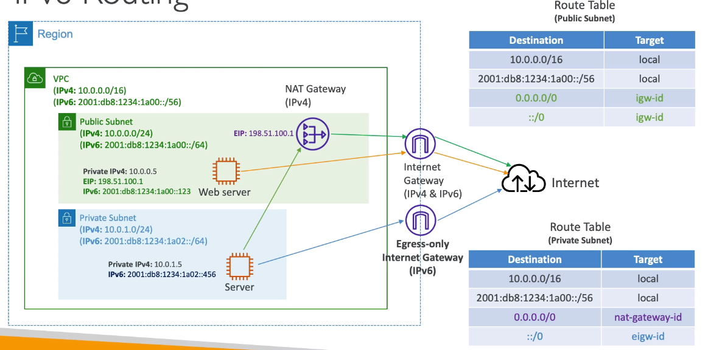

# AWS::EC2::EgressOnlyInternetGateway

- `NAT Gateway` for IPv6
- Allow only outbound traffic to internet
- Route table must be modified



## Properties

- <https://docs.aws.amazon.com/AWSCloudFormation/latest/UserGuide/aws-resource-ec2-egressonlyinternetgateway.html>

```yaml
Type: AWS::EC2::EgressOnlyInternetGateway
Properties:
  VpcId: String
```
