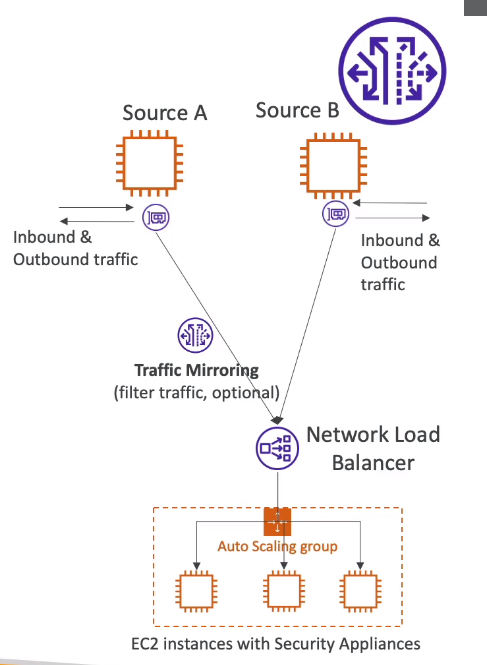

# AWS::EC2::TrafficMirrorSession

- `Capture` and `Inspect` traffic in your VPC
  - From (source): ENI
  - To (target): ENI or NLB
- Use cases
  - Threat monitoring
  - Troubleshooting
  - ...



## Properties

- <https://docs.aws.amazon.com/AWSCloudFormation/latest/UserGuide/aws-resource-ec2-trafficmirrorsession.html>

```yaml
Type: AWS::EC2::TrafficMirrorSession
Properties:
  Description: String
  NetworkInterfaceId: String
  PacketLength: Integer
  SessionNumber: Integer
  Tags:
    - Tag
  TrafficMirrorFilterId: String
  TrafficMirrorTargetId: String
  VirtualNetworkId: Integer
```
