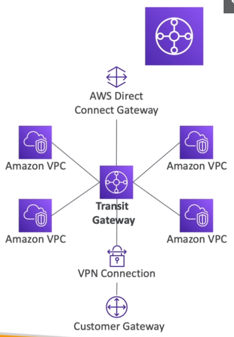
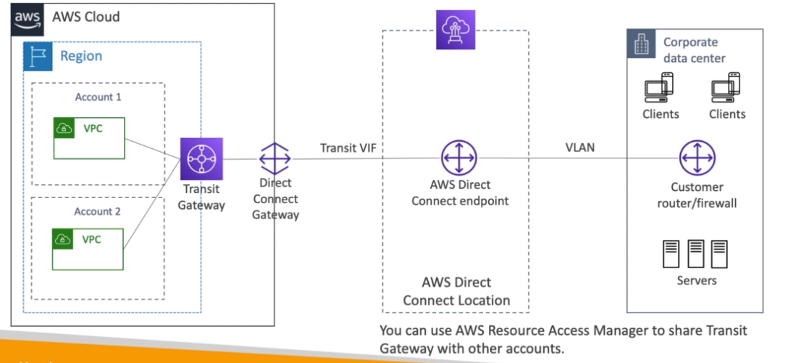

# AWS::EC2::TransitGateway

- Transitive `peering` between `thousand VPCs` and `on-premises`
- `Hub and Spoke` model (star)
- `Route Tables limit` the connection between the VPCs
- Supports `IP Multicast`

## Properties

- <https://docs.aws.amazon.com/AWSCloudFormation/latest/UserGuide/aws-resource-ec2-transitgateway.html>

- **Shared services VPC**
  - Share VPCs across accounts

### VpnEcmpSupport

- **Site-To-Site VPN ECMP**
- Increases the `bandwidth` of the s2s connections using `ECMP` (Equal Cost Multipath routing)
- Forwards the traffic over `multiple best path` (`multiple tunnels` at the same time)
