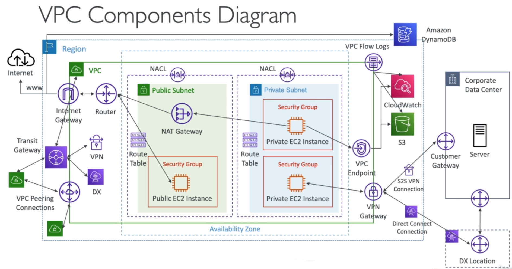
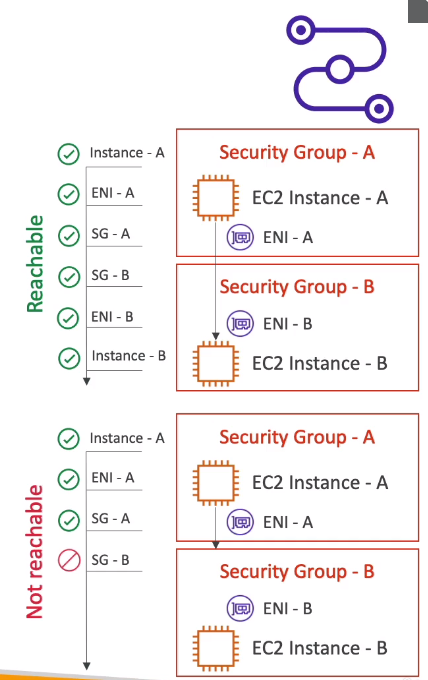

# AWS::EC2::VPC



- Specifies a VPC with the specified IPv4 CIDR block
- `Default VPC` is automatically created to deploy services if no VPC is specified
- Each region can have up to `5 VPCs` (soft limit)
- A **Bastion Host** is used to `SSH` into private instances. It sits in a public subnet. Ideally it must only allow certain IP ranges to access it
- **Reachability Analyzer**
  - `Troubleshoot` connectivity between 2 endpoints in VPC
  - Define a `src` and `dst` and a port to analyze
  - Just analyze the configuration. Do not send any packet



## Properties

- <https://docs.aws.amazon.com/AWSCloudFormation/latest/UserGuide/aws-resource-ec2-vpc.html>

```yaml
Type: AWS::EC2::VPC
Properties:
  CidrBlock: String
  EnableDnsHostnames: Boolean
  EnableDnsSupport: Boolean
  InstanceTenancy: String
  Ipv4IpamPoolId: String
  Ipv4NetmaskLength: Integer
  Tags:
    - Tag
```

### CidrBlock

- Classless Inter-Domain Routing (`CIDR`): Base IP + Subnet Mask (/8, /16, /24, ...)

- Each VPC can have up to `5 CIDR` ranges
- Minimum `/28` (16 addresses)
- Maximum `/16` (65536 addresses)
- The CIDR `should not overlap` CIDR from other VPCs

- **IP ranges**
  - `IANA`: define IPv4 that will be used for private networking (LAN)
  - `10.0.0.0/8`: big networks
  - `172.16.0.0/12`: default aws (16-31)
  - `192.168.0.0/16`: home networks

### EnableDnsHostnames

- Defaults to true for the default VPC, false for new VPCs
- If true, automatically assign hostname for EC2 instances (if it has a public IP)
- With these settings, private dns zone can be set up in Route53

### EnableDnsSupport

- Enables DNS resolution. Defaults to true
- If true `AWS DNS server` will be queried (`169.254.169.253`)
