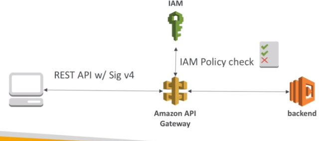
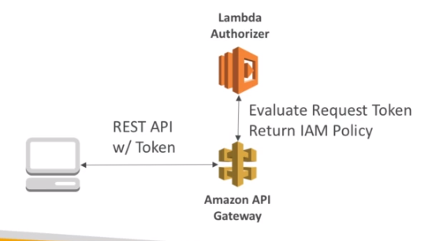
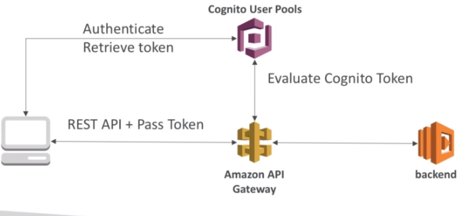

# AWS::ApiGatewayV2::Authorizer

## IAM through Sig v4

- Leverages `Sig v4` capability where IAM credentials are in headers



## Lambda Authorizer (custom authorizer)

- Uses `AWS Lambda` to valdiate the token in the request
- Good when using OAuth, SAML, etc
- The lambda must return an iam policy as a result



## Cognito User Pools

- `Cognito` manages the user lifecycle
- API gateway will verify identity from `AWS Cognito`
- Only authentication (not authorization)



## Properties

- <https://docs.aws.amazon.com/AWSCloudFormation/latest/UserGuide/aws-resource-apigatewayv2-authorizer.html>

```yaml
Type: AWS::ApiGatewayV2::Authorizer
Properties:
  ApiId: String
  AuthorizerCredentialsArn: String
  AuthorizerPayloadFormatVersion: String
  AuthorizerResultTtlInSeconds: Integer
  AuthorizerType: String
  AuthorizerUri: String
  EnableSimpleResponses: Boolean
  IdentitySource:
    - String
  IdentityValidationExpression: String
  JwtConfiguration:
    JWTConfiguration
  Name: String
```
