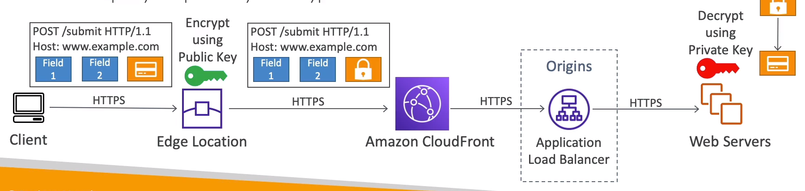
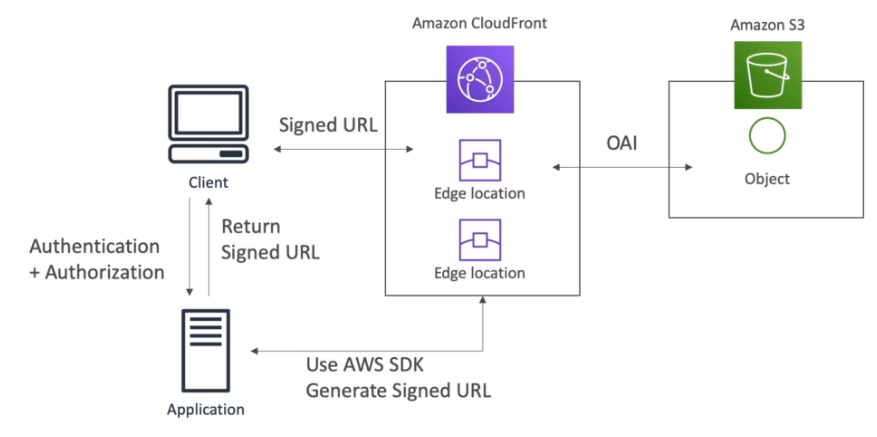

# AWS::CloudFront::PublicKey

- A public key that you can use with signed URLs and signed cookies, or with field-level encryption.

## Field-level encryption

- Encrypt certain field of the request
- These sensitive fields are encrypted in the `edge location` with a `public key`
- The `application` that receives the request will decrypt it with a `private key`

## Signed URLs and Signed cookies

- Restrict access to files to be retrieved
- The application now has to authentication and generate itself a signed url. The application use its own credentials
- Works for any origin (not only s3)
- E.g., to deliver paid content

- `Signed URL`: access to individual files
- `Signed Cookie`: access to multiple files

- Policies

  - `URL expiration`
  - `IP ranges` from client
  - `Trusted Signers`: aws accounts

