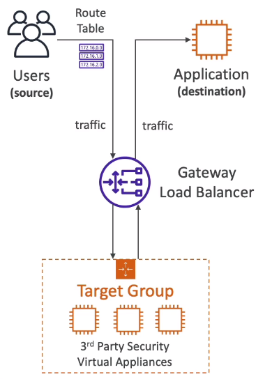

# Gateway Load Balancer (GWLB)

- 2020
- Operates at Layer 3 (IP Protocol - Network Layer)
- Allow packet to be inspected first by some other service in a target group
- A `Route Table` is configured at the VPC
- Uses `Geneve` protocol (6081 port)

