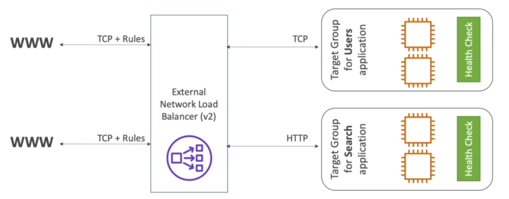

# Network Load Balancer (NLB)

- Network traffic is load balanced at `Layer 4` of the `OSI model`
- v2 (2017)

## Performance

- High performance (millions of requests per second)
- 100ms latency (400ms in ALB)

## Static IPs

- You are able to allocate `static IPs` (EIPs) with `NLBs`/ Differently from ALB that provides only the hostname
- NLB must be internet facing to get an `EIP`
- Use the command `aws ec2 allocate-address` to allocate (create) Elastic IP addresses
- You need to provide 1 EIP for each AZ (each subnet in each AZ) in which the LB is deployed
- To associate the EIPs with the ENIs of the LB use the command `aws ec2 associate-address`

## Protocols

- TCP
- UDP
- TLS (SSL)

## Security

- There is no termination in NLB, the request simply `pass through`
- There's no SG for NLB. This way, the only network security is the VPC NACL

## Health Checks

- Supports L4 (e.g., tcp) and L7 protocols (e.g., http)
