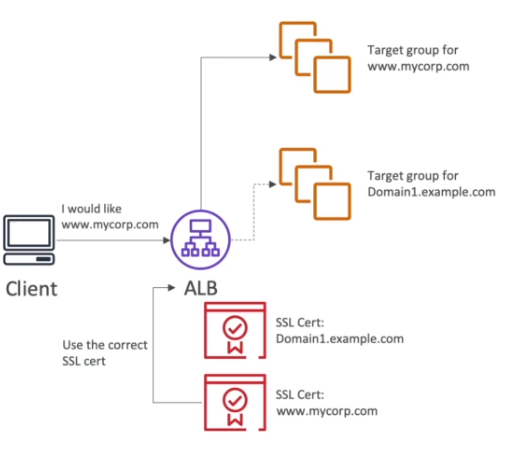

# AWS::ElasticLoadBalancingV2::Listener

```yaml
Type: AWS::ElasticLoadBalancingV2::Listener
Properties:
  AlpnPolicy:
    - String
  Certificates:
    - Certificate
  DefaultActions:
    - Action
  LoadBalancerArn: String
  Port: Integer
  Protocol: String
  SslPolicy: String
```

## Certificates

- Public SSL/TLS certificates are issued by `Certificate Authorities` (CA). e.g., GlobalSign, Digicert, Letsencrypt, etc
- LB uses the `X.509 certificate` (SSL/TLS server certificate)
- Certificates can be managed using `AWS Certificate Manager` (ACM)

- **HTTPS Listener**

  - Default certificate
  - Optional list of certs to support multiple domains (SNI)
  - HTTPS listeners can be configured under `Listeners` tab

- **Server Name Indication (SNI)**
  - Allows the server to load multiple certificates. For example, one for each target group
  - The client can then access the website through multiple subdomains and receive a different cert for each one of them
  - Only `ALB` and `NLB` support multiple listeners with multiple certs using SNI


