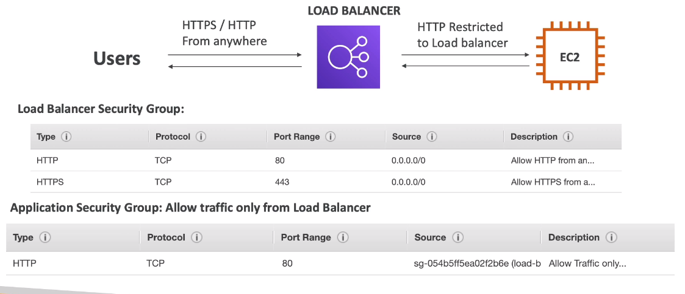

# AWS::ElasticLoadBalancingV2::LoadBalancer

- Forwards traffic to multiple servers (or EC2 instances)
- **Benefits**
  - `Spread load` evenly across multiple downstream instances
  - Expose a single `DNS`
  - Handle failure of downstream instances (regular `health check`)
  - `SSL` termination (HTTPS)
  - Enforce `stickiness` with cookies
- LB can be **internal** or **external**

```yaml
Type: AWS::ElasticLoadBalancingV2::LoadBalancer
Properties:
  IpAddressType: String
  LoadBalancerAttributes:
    - LoadBalancerAttribute
  Name: String
  Scheme: String
  SecurityGroups:
    - String
  SubnetMappings:
    - SubnetMapping
  Subnets:
    - String
  Tags:
    - Tag
  Type: String
```

## Security Group

- The SG of the EC2 instance now can have inbound rule from the LB SG (instead of allowing from anywhere)



## LoadBalancerAttributes

- **load_balancing.cross_zone.enabled**
  - Balance between instances in different AZs
  - A LB in a region cannot forward load to another region
  - `With Cross-Zone balancing` load is distributed evenly across all instances (in all AZs)
    - It's always enabled for ALB (cannot be disabled). It's free
    - It's enabled (by default) for CLB. It's free
    - It's disabled (by default) for NLB. It's paid
  - `Without Cross-Zone balancing` load is distributed for the AZ, and not for the total of instances itself
    

## Type

- **application** (ALB) - Layer 7

  - Ideal for HTTP, HTTPS, Websockets traffic
  - v2 (2016)
  - Balance to a _target groups_ (applications across machines) -> EC2, ECS, Lambda, IPs,
  - Allow `routing table` to different target groups
    - `Path`. E.g., /users, /posts
    - `Hostname`. E.g., one.example.com, two.example.com
    - `QueryString` & Headers. E.g., ?id=123&order=false
  - Has `port mapping` feature to redirect to dynamic port in ECS

  
  

  - `Fixed hostname` xxx.region.elb.amazonaws.com
  - The application don't receive the IP of the client directly (receives the internal IP of LB instead). Info about the client goes in the headers `X-Forwarded-For` `X-Forwarded-Port` `X-Forwarded-Proto`

  

- **network** (NLB) - Layer 4

  - Ideal for TCP and UDP traffic
  - v2 (2017)
  - TCP & SSL (L4), UDP (L4)
  - High performance (millions of requests per second)
  - 100ms latency (400ms in ALB)
  - Provides `Static IPs` for each AZ (differently from ALB that provides only the hostname)
  - There is not termination in NLB, the request simply `pass through`
  - There's no SG for NLB. This way, the only network security is the VPC NACL

  

- **gateway** (GWLB)

  - 2020
  - Operates at Layer 3 (IP Protocol - Network Layer)
  - Allow packet to be inspected first by some other service in a target group
  - A `Route Table` is configured at the VPC
  - Uses `Geneve` protocol (6081 port)

  
