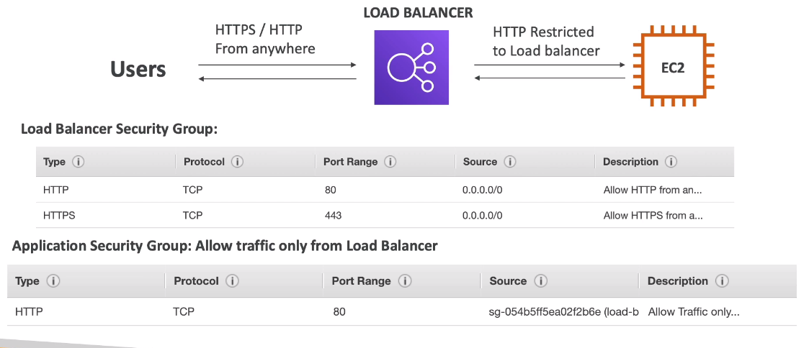
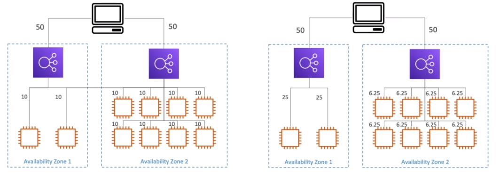

# AWS::ElasticLoadBalancingV2::LoadBalancer

- Forwards traffic to multiple servers (or EC2 instances)
- **Benefits**
  - `Spread load` evenly across multiple downstream instances
  - Expose a single `DNS`
  - Handle failure of downstream instances (regular `health check`)
  - `SSL` termination (HTTPS)
  - Enforce `stickiness` with cookies
- LB can be **internal** or **external**

## Properties

- <https://docs.aws.amazon.com/AWSCloudFormation/latest/UserGuide/aws-resource-elasticloadbalancingv2-loadbalancer.html>

```yaml
Type: AWS::ElasticLoadBalancingV2::LoadBalancer
Properties:
  EnforceSecurityGroupInboundRulesOnPrivateLinkTraffic: String
  IpAddressType: String
  LoadBalancerAttributes:
    - LoadBalancerAttribute
  Name: String
  Scheme: String
  SecurityGroups:
    - String
  SubnetMappings:
    - SubnetMapping
  Subnets:
    - String
  Tags:
    - Tag
  Type: String
```

### SecurityGroups

- With a LB, the EC2 can have an inbound rule to restricting access only from the LB (instead of allowing from anywhere)



### LoadBalancerAttributes

- **load_balancing.cross_zone.enabled**
  - Balance between instances in different AZs
  - However, a LB in a region cannot forward load to another region (in this case one LB in each region is necessary)
  - `With Cross-Zone balancing` load is distributed evenly across all instances (in all AZs)
    - It's always enabled for ALB (cannot be disabled). It's free
    - It's enabled (by default) for CLB. It's free
    - It's disabled (by default) for NLB. It's paid
  - `Without Cross-Zone balancing` load is distributed for the AZ, and not for the total of instances itself
    

### Type

- Application Load Balancer (ALB)
- Network Load Balancer (NLB)
- Gateway Load Balancer (GWLB)

> Classic Load Balancer (CLB) is created with AWS::ElasticLoadBalancing::LoadBalancer
