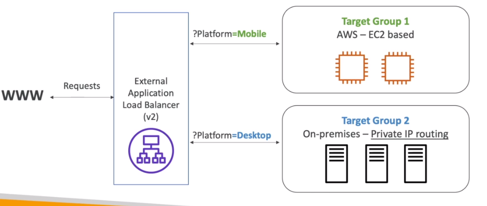
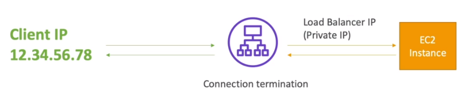

# Application Load Balancer (ALB)

- Layer 7
- Ideal for HTTP, HTTPS, Websockets traffic
- v2 (2016)
- ALB provides a fixed DNS `xxx.region.elb.amazonaws.com`

## Target Groups

- Balance to _target groups_ (applications across machines) -> EC2, ECS, Lambda, IPs,
- Has `port mapping` feature to redirect to dynamic port in ECS

## Routing Table

- Allow `routing table` to different target groups

- **Path**
  - E.g., /users, /posts
  

- **Hostname**
  - E.g., one.example.com, two.example.com

- **Request Data**
  - `QueryString`: ?id=123&order=false
  - `Headers`
  - `Method`
  - `Source IP`
  

## Data redirect

- The application don't receive the IP of the client directly (receives the internal IP of LB instead). Info about the client goes in the headers `X-Forwarded-For` `X-Forwarded-Port` `X-Forwarded-Proto`

