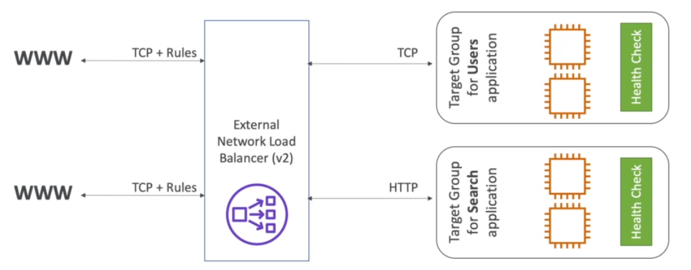

# Network Load Balancer (NLB)

- Network traffic is load balanced at `Layer 4` of the `OSI model`
- v2 (2017)
- High performance (millions of requests per second)
- 100ms latency (400ms in ALB)
- Provides `Static IPs` for each AZ (differently from ALB that provides only the hostname)
- There is not termination in NLB, the request simply `pass through`
- There's no SG for NLB. This way, the only network security is the VPC NACL

## Protocols

- TCP
- UDP
- TLS (SSL)

## Health Checks

- Supports L4 (e.g., tcp) and L7 protocols (e.g., http)
