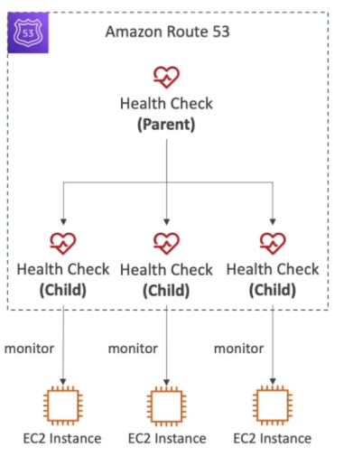
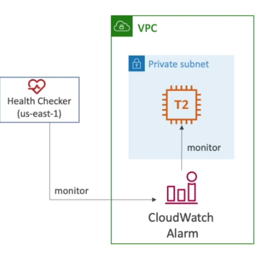

# AWS::Route53::HealthCheck

- Check health of a resource before responding to the DNS query
- This way, automated `DNS failover` is performed
- Metric
  - `Endpoint`
  - `Other healthchecks` (calculated health check)
  - `Cloudwatch`
- `15 global health checkers` will check the endpoint health
- If 18% say it's healthy, then route 53 considers it healthy
- You must configure the application security group to allow requests from route 53
- `Calculated health checks` can combine the results from multiple health checks
  - Conditions can be OR, AND or NOT

- For private resources, a health check to monitor a `cloudwatch alarm` can be used
- This is necessary because route53 do not have direct access to other aws resources

