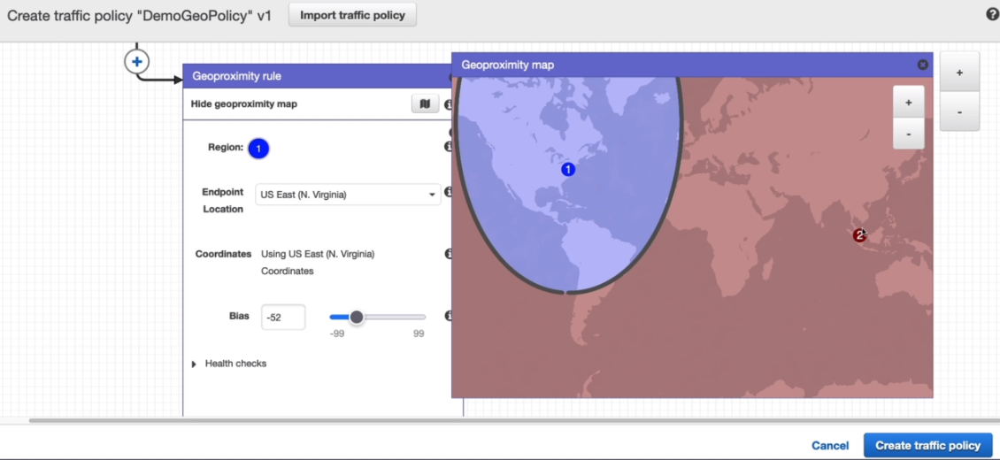

# AWS::Route53::RecordSet

- **Routing Policies**
  - _Simple_
    - `Single` or `Multiple` value is responded
    - If multiple values is responded, client will be randonly
    - Cannot be associated to health checks
  - _Weighted_
    - Single value is responded according to a `weighted list`
    - Can be combined with health checks
  - _Geolocation_
    - Based on the `continent` or `country`
    - A default routing can be set for no matches
  - _Latency based_
    - Return value with `lowest latency` for the client
    - Can be combined with health checks
  - _Failover_
    - Primary and Secondary values
    - If the primary record is not `healthy`, return the secondary record
  - _Multivalue Answer_
    - Use traffic to multiple values
    - Up to 8 records
    - It's a `client-side LB`
    - Can be combined with health checks to respond only healthy resources
  - _Geoproximity_
    - Based on geographic location
    - Route 53 `traffic flow` feature must be used to configure this policy
    - The `bias` (like a radius) is how much the traffic is going to a specific resource (1 - 99)

- **Traffic Flow**
  - Visual editor to create routing configuration using existing routing types such as `failover` and `geolocation`
  - You save the configuration as a `traffic policy` and then use it to create one or more policy records.

  

```yaml
Type: AWS::Route53::RecordSet
Properties:
  AliasTarget: AliasTarget
  Comment: String
  Failover: String
  GeoLocation: GeoLocation
  HealthCheckId: String
  HostedZoneId: String
  HostedZoneName: String
  MultiValueAnswer: Boolean
  Name: String
  Region: String
  ResourceRecords:
    - String
  SetIdentifier: String
  TTL: String
  Type: String
  Weight: Integer
```


## AliasTarget

- `CNAME Record`
  - Cannot be used for top node domains (`zone apex`. e.g., example.com)
  - E.g., app.hvitoi.com -> <www.google.com>
- `Alias Record`
  - Points a hostname to a AWS Resource (expect ec2 dns names)
    - ELB
    - CloudFront
    - API Gateway
    - Elastic Beanstalk
    - S3 Websites
    - VPC Interface Endpoints
    - Route 53 record in the same hosted zone
  - It's specific to Route 53 (it's an extension of DNS functionality)
  - For root and non-root domains
  - Free of charge!
  - Offer native health check
  - It's always A or AAAA
  - E.g., example.com -> awslb.aws.com

## TTL

- `TTL` (time to live): how long the record will be cached in the client's computer

## Type

- `A`: hostname to IPv4
  - webserver 192.168.1.1
- `AAAA`: hostname to IPv6
  - webserver 2804:14d:1:0:181:213:132:4
- `CNAME`: hostname to hostname (aliases)
  - CNAMEs can be created for subdomains only (not example.com)
  - food.example.com eat.example.com,hungry.example.com
- `NS`: IP addresses of the servers that can respond to DNS queries for the hosted zone

- Others: `CAA`, `DS`, `MX`, `NAPTR`, `PTR`, `SOA`, `TXT`, `SPF`, `SRV`
