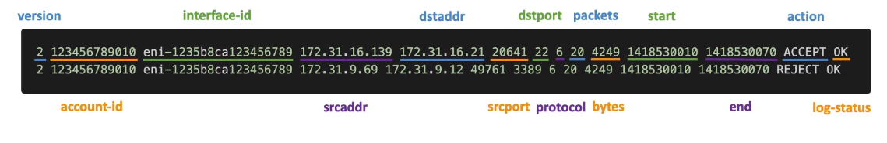

# AWS::EC2::FlowLog

- Flow logs is created at the `VPC` tab
- `Capture traffic` going into your interfaces
  - `VPC Flow Log`
  - `Subnet Flow Log`
  - `ENI Flow Log`
- Monitor and Troubleshoot connectivity issues
- Flow Logs can be stored in S3/Cloudwatch and analyzed with Athena



## Properties

- <https://docs.aws.amazon.com/AWSCloudFormation/latest/UserGuide/aws-resource-ec2-flowlog.html>

```yaml
Type: AWS::EC2::FlowLog
Properties:
  DeliverCrossAccountRole: String
  DeliverLogsPermissionArn: String
  DestinationOptions:
    DestinationOptions
  LogDestination: String
  LogDestinationType: String
  LogFormat: String
  LogGroupName: String
  MaxAggregationInterval: Integer
  ResourceId: String
  ResourceType: String
  Tags:
    - Tag
  TrafficType: String
```
