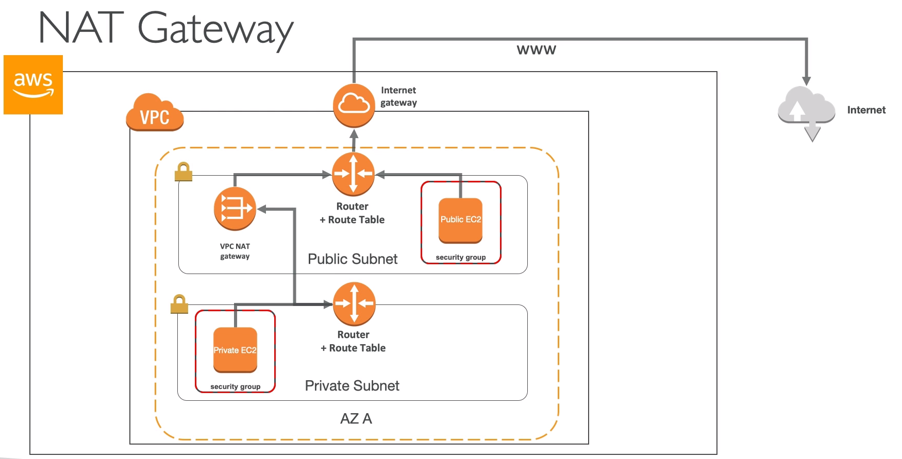

# AWS::EC2::NatGateway

- `Network Address Translation` (NAT)
- IPv4 only

- **NAT Instances** (deprecated)

  - It's a `service` (deployed in `EC2`). It must be deployed in a `public subnet` with inbound rule on port 80 allowing traffic from the `private subnet`
  - Allow private subnets (no public ip) to reach internet (by means of the nat instance in the public subnet)
  - Must disable `Source/Destination Check` in EC2 instance
  - A record for `destination to 0.0.0.0/0 with target to NAT instance` must be inserted in the `route table` for the private subnet

- **NAT Gateway**

  - AWS Managed! (alternative to NAT instance)
  - `5 Gbps` bandwidth with automatic scaling up to 45 Gbps
  - NAT Gateway receives an Elastic IP
  - Single AZ (but can be deployed to multiple AZs)

