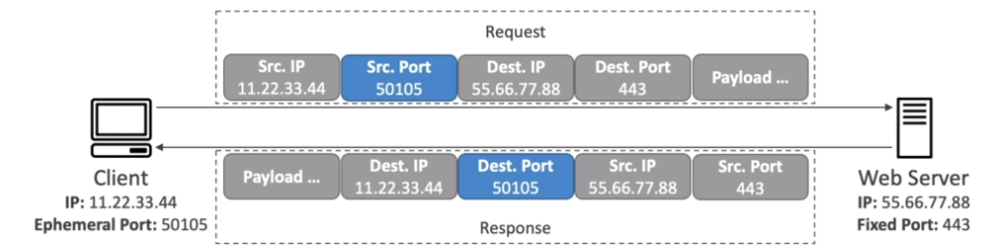

# AWS::EC2::NetworkAcl

- Firewall that controls inbound and outbound traffic to a subnet
- Differently from `Security Group` it sits at `subnet level`
- ACLs are evaluated before security groups
- Supports `ALLOW` AND `DENY` rules (NG only allows)

- Both `inbound` and `outbound` rules in NACL are evaluated separately for each request (`stateless`)
- Rules in `SG` are `stateful`. So what counts is if it's incoming or outgoing origin (regardless if it has a response)

- NACL rules have a `precedence number` (1-32766). The first rule that matches is used
- The last rule is a `DENY` to `*`
- The `default NACL` accepts all inbound/outbound requests

- `Ephemeral Ports` is a port used by the client only to receive the response (32k - 65k)
  - This allows using a different ports for the request and response
  - This way, the NACL outbound rule can allow only the ephemeral ports range (and not everything \*)

