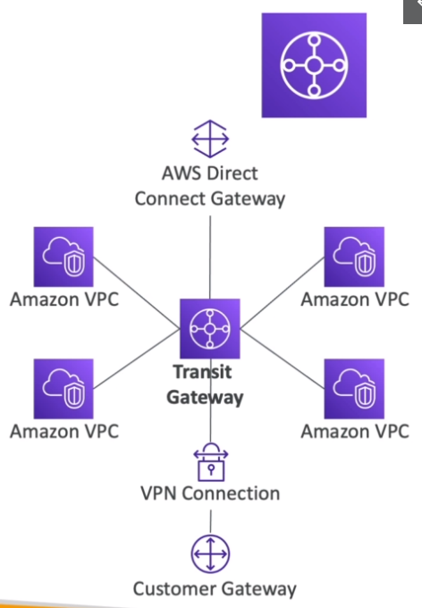

# AWS::EC2::TransitGateway

- Transitive `peering` between `thousand VPCs` and `on-premises`
- `Hub and Spoke` model (star)
- `Route Tables limit` the connection between the VPCs
- Supports `IP Multicast`



```yaml
Type: AWS::EC2::TransitGateway
Properties:
  AmazonSideAsn: Integer
  AssociationDefaultRouteTableId: String
  AutoAcceptSharedAttachments: String
  DefaultRouteTableAssociation: String
  DefaultRouteTablePropagation: String
  Description: String
  DnsSupport: String
  MulticastSupport: String
  PropagationDefaultRouteTableId: String
  Tags:
    - Tag
  TransitGatewayCidrBlocks:
    - String
  VpnEcmpSupport: String
```

- **Shared services VPC**
  - Share VPCs across accounts


## VpnEcmpSupport

- **Site-To-Site VPN ECMP**
- Increases the `bandwidth` of the s2s connections using `ECMP` (Equal Cost Multipath routing)
- Forwards the traffic over `multiple best path` (`multiple tunnels` at the same time)
