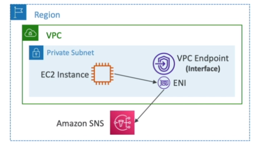
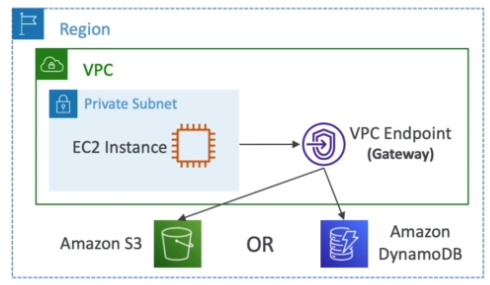

# AWS::EC2::VPCEndpoint

- Specifies a `VPC endpoint` (a gateway) to access aws services `internally`
- An endpoint enables you to create a `private connection` between your VPC and the service
- An entry is automatically added to the route table of the corresponding subnet

```yaml
Type: AWS::EC2::VPCEndpoint
Properties:
  PolicyDocument: Json
  PrivateDnsEnabled: Boolean
  RouteTableIds:
    - String
  SecurityGroupIds:
    - String
  ServiceName: String
  SubnetIds:
    - String
  VpcEndpointType: String
  VpcId: String
```

## VpcEndpointType

- `Interface`: provisions an ENI (private ip) as entry point to the AWS service
  

- `Gateway`: Only for S3 and DynamoDB
  
