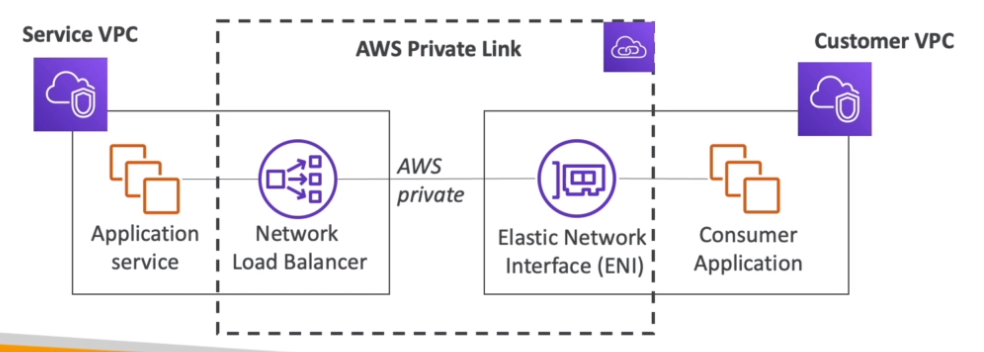
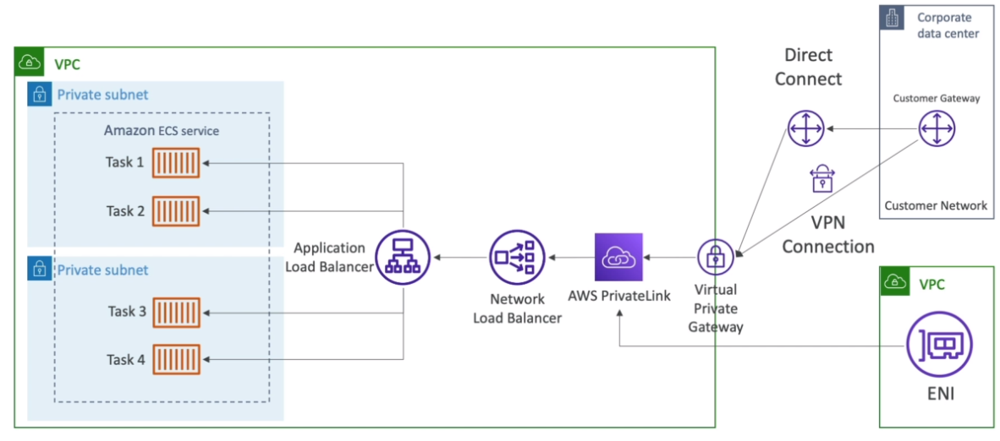

# AWS::EC2::VPCEndpointService

- `Expose just one service` within a VPC (and not the whole VPC as in peering)
- Secure way to expose a service to many VPCs (own or cross account)
- Needs a `NLB`/`GWLB` to expose the service and an `ENI` on the customer side
- The `PrivateLink` links the NLB to the ENI

- After the `Endpoint Service` is created, it must be added as a regular `Endpoint` (find service by name)
